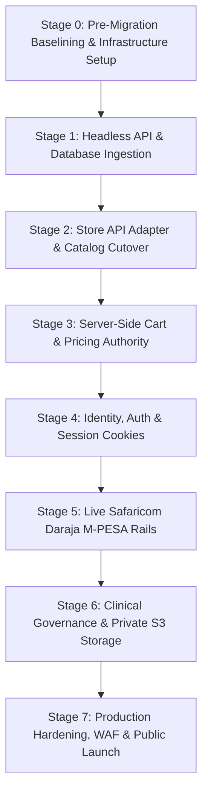

# EYEKART — PRODUCTION MIGRATION & CUTOVER STRATEGY
## Phase 6.0 Safe Engineering Migration Blueprint
**Authoritative Implementation & Migration Directive**  
**Version:** 1.0  
**Date:** September 15, 2026  
**Status:** COMPLETE & AUTHORITATIVE  
**Classification:** `PASS — MIGRATION PLAN COMPLETE`  

---

## 1. EXECUTIVE SUMMARY & ZERO-DRIFT COMMITMENT

This document specifies the safe, multi-stage migration roadmap for transitioning the EyeKart Optical Commerce Platform from its current client-side demonstration architecture into a hardened, production-ready system.

### Absolute Migration Invariants:
1. **0% Stitch Visual Drift:** The twenty-three (23) approved Stitch HTML panels and CSS styling must remain pixel-identical and functionally intact throughout the transition.
2. **Adapter-Based Migration:** The migration decouples `assets/js/eyekart-store.js` by swapping internal `localStorage` operations with asynchronous REST API network adapters without breaking existing store subscribers or DOM bindings.
3. **Phased Cutover with Feature Flags:** Every subsystem (Catalog, Cart, Auth, Payments, Clinical Operations) transitions independently behind feature flags with instantaneous rollback capabilities.

---

## 2. THE 8-STAGE MIGRATION SEQUENCE



### Stage 0: Infrastructure Foundation & CI/CD Pipeline
- **Actions:**
  - Provision managed PostgreSQL 16 database (AWS RDS / Aurora) and Redis 7 cluster.
  - Set up private S3 bucket with KMS envelope encryption and Cloudflare CDN zone.
  - Configure automated deployment pipelines with GitHub Actions for linting, database migrations (Prisma / Flyway), and container deployment to AWS ECS / Fargate.
  - Store all production credentials (Safaricom Daraja, KRA eTIMS, S3 keys) in AWS Secrets Manager.
- **Rollback Safety:** Pure infrastructure provisioning; zero effect on existing application runtime.

### Stage 1: Headless REST API & Catalog Ingestion
- **Actions:**
  - Deploy Node.js Fastify API service implementing OpenAPI 3.0 endpoints for `/api/v1/products`.
  - Ingest `catalog-data.js` static records (`EK-902`, `EK-804`, etc.) into PostgreSQL `products`, `product_variants`, and `inventory_items` tables via seed scripts.
  - Deploy health check and observability endpoints (`/health/liveness`, `/health/readiness`).
- **Rollback Safety:** The server runs in parallel without receiving frontend traffic.

### Stage 2: Store Adapter Layer & Catalog Cutover
- **Actions:**
  - Introduce an asynchronous backend adapter inside `assets/js/eyekart-store.js`.
  - Feature flag: `window.EYEKART_USE_BACKEND = true | false`.
  - When enabled, `CatalogService.getAll()` and `CatalogService.getBySku()` query `/api/v1/products` instead of the static in-memory array.
  - Graceful fallback: If the API is unreachable, the store falls back to `catalog-data.js` immediately.
- **Verification:** Assert that faceted filtering, 3D Studio specifications, and catalog badges remain identical.

### Stage 3: Server-Side Cart & Authoritative Pricing
- **Actions:**
  - Route cart mutations (`addCartItem`, `removeCartItem`) to `/api/v1/cart`.
  - Migrate the optical diopter formula engine (`lens-configurator-engine.js`) logic to the backend to compute lens index surcharges, coating fees, and VAT on the server.
  - During checkout quote calculation, client prices are completely ignored; the server returns the signed quote.
- **Rollback Safety:** Toggle feature flag back to local in-memory cart if cart sync issues occur.

### Stage 4: Authentication, Profiles & RBAC
- **Actions:**
  - Introduce registration and login modals behind existing header login triggers.
  - Issue HTTP-only, Secure, SameSite=Strict cookies containing rotated JWT session tokens.
  - Migrate user address book and order history from `localStorage` to PostgreSQL tables upon first login.
  - Implement role verification middleware: access to `/optometry/queue` requires verified optometrist credentials.

### Stage 5: Live Safaricom Daraja M-PESA Settlement
- **Actions:**
  - Connect `/api/v1/payments/mpesa/stk-push` to Safaricom Daraja 2.0 gateway.
  - Deploy public webhook endpoint `/api/v1/webhooks/daraja` with HMAC-SHA256 signature verification and IP subnet filtering.
  - Configure background BullMQ worker for failover polling (`POST /mpesa/stkpushquery/v1/query`).
  - Wire payment success events directly to order confirmation and dispatch telemetry.
- **Rollback Safety:** Ability to switch gateway from `LIVE` mode back to `DEMO_SIMULATION` instantly via environment variable.

### Stage 6: Clinical Prescriptions & Private S3 Document Storage
- **Actions:**
  - Migrate prescription submission (`POST /api/v1/prescriptions`) to PostgreSQL with AES-256-GCM encryption on diopter fields.
  - Enable direct client uploads of prescription slips and OCT scans to private S3 buckets using time-limited pre-signed URLs.
  - Wire clinical review actions (Approve, Reject, Clarification) in `eyekart_clinical_examination_report_precision_diopter_summary` to `/api/v1/optometry/reviews`.
  - Ensure digital OCK verification tokens are signed using the clinician's private server key.

### Stage 7: Production Hardening, Compliance & Go-Live
- **Actions:**
  - Configure Cloudflare Enterprise WAF with DDoS mitigation and rate-limiting rules.
  - Enforce strict Content Security Policy (CSP) headers across all Stitch templates.
  - Perform automated end-to-end regression audit covering all 40 system assertions.
  - Cut over DNS records to production edge.

---

## 3. DATA RECONCILIATION & MIGRATION SCRIPT TEMPLATE

To transition historical test and demonstration orders from client browser storage without corrupting production data, the following automated ingestion script runs upon user authentication:

```javascript
/**
 * EyeKart Client-to-Server Ingestion Utility (Runs Once Post-Authentication)
 */
async function syncLocalStorageToServer(authToken) {
  const STORAGE_KEY = 'eyekart_store_state_v1_1';
  const raw = localStorage.getItem(STORAGE_KEY);
  if (!raw) return;

  try {
    const localState = JSON.parse(raw);
    if (localState.wishlist && localState.wishlist.length > 0) {
      await fetch('/api/v1/account/wishlist/sync', {
        method: 'POST',
        headers: { 'Content-Type': 'application/json', 'Authorization': `Bearer ${authToken}` },
        body: JSON.stringify({ skus: localState.wishlist })
      });
    }
    console.info('[EyeKart Migration] Client wishlist successfully reconciled with server account.');
  } catch (err) {
    console.warn('[EyeKart Migration] Non-critical state sync warning:', err);
  }
}
```

---

## 4. MULTI-ENVIRONMENT TOPOLOGY

| Environment | Purpose | Database | M-PESA Gateway | Domain |
| :--- | :--- | :--- | :--- | :--- |
| **DEVELOPMENT**| Local feature engineering | Docker PostgreSQL 16 | Safaricom Sandbox / Mock | `http://127.0.0.1:3000` |
| **TEST / CI** | Automated CDP & assertion suites | Ephemeral SQLite / Postgres | Mock Service Worker | GitHub Actions Runner |
| **STAGING** | End-to-end integration & UAT | Managed RDS (Staging DB) | Safaricom Sandbox Rail | `https://staging.eyekart.ke` |
| **PRODUCTION** | Live commercial operations | Multi-AZ Aurora PostgreSQL | Safaricom Live Production | `https://eyekart.ke` |

---

## 5. BUSINESS DEPENDENCIES CHECKLIST

Prior to executing Stage 5 (Live M-PESA) and Stage 7 (Go-Live), the business entity must secure:
- [ ] Legal incorporation of EyeKart Limited in Kenya.
- [ ] Registered trademark and production domain name (`eyekart.ke`).
- [ ] Safaricom Daraja Business Paybill / Till Number and Live API credentials.
- [ ] KRA PIN and eTIMS middleware credentials for electronic tax compliance.
- [ ] Registered corporate optical practice license with the Optometrists and Dispensing Opticians Board of Kenya (ODBK / OCK).
- [ ] Commercial service level agreements (SLAs) with Nairobi express motorcycle courier partners (e.g. Sendy / Fargo).
- [ ] Underwriter integration agreements for live insurance claims EDI (CarePay / Smart Applications).

---

## 6. CONCLUSION

The EyeKart Production Migration Plan guarantees a seamless, risk-free transition from client demo to enterprise-grade optical commerce platform. By preserving the visual design and using non-destructive adapter patterns, engineering can stand up the backend without interrupting ongoing client demonstrations or risking visual regressions.
