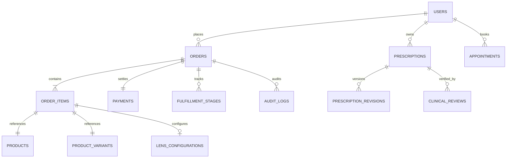

# EYEKART — PRODUCTION BACKEND, SECURITY & DATA ARCHITECTURE
## Phase 6.0 Architecture Decision Blueprint & Production Specification
**Authoritative Engineering Directive & Readiness Audit**  
**Version:** 1.0  
**Date:** September 15, 2026  
**Status:** COMPLETE & AUTHORITATIVE  
**Classification:** `PASS — PRODUCTION ARCHITECTURE DISCOVERY COMPLETE`  

---

## 1. EXECUTIVE SUMMARY & VERDICT

The EyeKart Optical Commerce Platform has completed a forensic discovery and architectural audit under **Phase 6.0 (Production Backend, Security & Data Architecture Discovery / Readiness Audit)**.

### Architectural Reality Statement:
EyeKart currently operates as a client-orchestrated optical commerce demonstration served locally via `python serve.py` on port 3000. All state management, catalog data, lens pricing calculations, optical prescription verification, order snapshots, simulated M-PESA STK push workflows, and fulfillment stage transitions are hosted within the user's browser runtime and persisted in `localStorage` (`eyekart_store_state_v1_1`).

$$\begin{aligned}
\text{Current Reality:} \quad &\text{Browser Runtime} \xrightarrow{\text{Direct Control}} \text{Price, SKU, Rx Verification, M-PESA Demo, Admin Role} \\
\text{Production Target:} \quad &\text{Browser Runtime (Untrusted)} \xrightarrow{\text{mTLS / HTTPS / JWT}} \text{API Gateway} \xrightarrow{\text{ACID}} \text{PostgreSQL + Daraja + S3}
\end{aligned}$$

### Final Classification:
> [!IMPORTANT]
> **CERTIFIED VERDICT:**  
> `PASS — PRODUCTION ARCHITECTURE DISCOVERY COMPLETE`  
> 
> *Discovery is complete. We now possess the exhaustive technical blueprint, relational schema, security trust boundaries, API specifications, and migration path required to build the production backend without having modified or compromised the approved, visually frozen Stitch client.*

---

## 2. SYSTEM BOUNDARY & PARADIGM SHIFT

### 2.1 What Must Move Server-Side
1. **Financial Authority:** Frame prices, lens index fees, coating surcharges, VAT (16% KRA standard or optical exemption), delivery fees, and order totals must be computed exclusively by the server.
2. **Payment Processing:** Safaricom Daraja 2.0 OAuth token generation, STK push initiation, callback webhook handlers, receipt validation, and refund authorization.
3. **Data Persistence & Integrity:** PostgreSQL database with ACID transactions, relational integrity, unique constraints, and foreign keys for products, users, prescriptions, orders, payments, and inventory.
4. **Identity & Access Management:** User registration, password hashing (Argon2id), session management, HTTP-only Secure SameSite cookies, JWT verification, and Role-Based Access Control (RBAC).
5. **Clinical Governance:** Attending optometrist authentication, official council license validation (Optometrists and Dispensing Opticians Board of Kenya - ODBK / OCK), tamper-evident prescription revision logs, and clinical approval signing.
6. **Document Storage:** Private S3-compatible object storage with server-side encryption (AES-256) and time-limited pre-signed URLs for prescription slips, clinical diagnostic reports, and KRA tax invoices.
7. **Audit Trails:** Immutable, append-only security and operational audit logs recording actor identity, IP, user agent, timestamp, action, and entity state transitions.

### 2.2 What Can Remain Client-Side
1. **Biometric Privacy & VTO:** Real-time facial landmark detection (MediaPipe FaceMesh 468 points), iris tracking, Pupillary Distance (PD) estimation, and 2D/3D frame overlay remain **100% client-side**. Webcam frames and facial geometry are never transmitted to or stored on the server.
2. **Interactive 3D Studio:** Three.js WebGL rendering, orbit controls, material property inspection (metallic, roughness, transmissive lenses), and FOV framing.
3. **Reactive UI State:** Local cart drawer toggling, faceted filter state, tab switches, diopter +/- transpose format preview, and input masking.

---

## 3. RECOMMENDED PRODUCTION TECHNOLOGY STACK

```
┌─────────────────────────────────────────────────────────────────────────┐
│                           CLIENT BROWSER                                │
│  Stitch Approved UI (23 Panels) • Tailwind CSS • Three.js • MediaPipe   │
└────────────────────────────────────┬────────────────────────────────────┘
                                     │ HTTPS / WSS / HTTP-only Cookies
                                     ▼
┌─────────────────────────────────────────────────────────────────────────┐
│                    API GATEWAY / LOAD BALANCER                          │
│               Cloudflare (WAF, DDoS, Edge SSL, CDN)                     │
└────────────────────────────────────┬────────────────────────────────────┘
                                     │
                                     ▼
┌─────────────────────────────────────────────────────────────────────────┐
│                     APPLICATION / API LAYER                             │
│       Node.js (TypeScript) + Fastify (High-throughput REST API)         │
│  - Auth & RBAC (Argon2id, JWT)       - Optical Engine (Validation)      │
│  - Commerce & Price Authority        - Daraja M-PESA Integration        │
└──────────────┬─────────────────────┬──────────────────────┬─────────────┘
               │                     │                      │
               ▼                     ▼                      ▼
┌──────────────────────┐   ┌──────────────────┐   ┌──────────────────────┐
│  PRIMARY RELATIONAL  │   │  REDIS CACHE &   │   │  ENCRYPTED OBJECT    │
│      DATABASE        │   │    TASK QUEUE    │   │       STORAGE        │
│ PostgreSQL 16 (ACID) │   │ Redis 7 (BullMQ) │   │ AWS S3 / GCS (SSE)   │
│ - Schemas & Ledger   │   │ - Cart sessions  │   │ - Prescription slips │
│ - Encryption at rest │   │ - Daraja retries │   │ - Clinical PDF scans │
│ - Audit trail tables │   │ - SMS / Mailers  │   │ - 3D GLB frame assets│
└──────────────────────┘   └──────────────────┘   └──────────────────────┘
```

### 3.1 Technology Evaluation & Selection Rationale
- **API Runtime: Node.js (TypeScript) + Fastify**
  - *Rationale:* Native JSON throughput, lightweight memory footprint, shared TypeScript types with frontend optical mathematical engines, schema validation with Ajv/TypeBox, low-latency execution suited for high-concurrency mobile M-PESA traffic.
- **Relational Database: PostgreSQL 16**
  - *Rationale:* Optical commerce demands strict relational guarantees across products, variants, diopter configurations, payments, and regulatory medical records. JSONB support allows semi-structured optical metadata (e.g. lens coatings, extended wavefront parameters) while enforcing foreign key constraints and ACID transaction isolation.
- **Cache & Queue: Redis 7 + BullMQ**
  - *Rationale:* Fast session/cart cache, rate limiting, and reliable asynchronous background processing for M-PESA STK query retries, Africa's Talking SMS delivery, and KRA eTIMS invoice generation.
- **Object Storage: AWS S3 / GCP Cloud Storage with SSE-KMS**
  - *Rationale:* Strict access segregation: Public read bucket for 3D GLB models and product gallery; private, encrypted bucket with signed time-limited URLs (15-minute expiry) for clinical prescriptions and KRA invoices.

---

## 4. RELATIONAL DATA MODEL & POSTGRESQL SCHEMA SPECIFICATION

The production database schema consists of five core domains:



### 4.1 Users & Authentication (`users`, `roles`, `optometrist_profiles`)
```sql
CREATE TABLE users (
    id UUID PRIMARY KEY DEFAULT gen_random_uuid(),
    email VARCHAR(255) UNIQUE NOT NULL,
    phone VARCHAR(32) UNIQUE NOT NULL, -- E.164 (+254...)
    password_hash VARCHAR(255) NOT NULL, -- Argon2id
    full_name VARCHAR(128) NOT NULL,
    role VARCHAR(32) NOT NULL DEFAULT 'CUSTOMER', -- 'CUSTOMER', 'OPTOMETRIST', 'ADMIN', 'LAB_TECH', 'DISPATCH'
    tier VARCHAR(64) DEFAULT 'Standard',
    is_active BOOLEAN DEFAULT TRUE,
    created_at TIMESTAMPTZ DEFAULT CURRENT_TIMESTAMP,
    updated_at TIMESTAMPTZ DEFAULT CURRENT_TIMESTAMP
);

CREATE TABLE optometrist_profiles (
    id UUID PRIMARY KEY DEFAULT gen_random_uuid(),
    user_id UUID NOT NULL REFERENCES users(id) ON DELETE CASCADE,
    council_registration_number VARCHAR(64) UNIQUE NOT NULL, -- e.g. "OCK #0512"
    qualifications VARCHAR(128) NOT NULL, -- e.g. "MCOptom", "OD"
    clinic_id VARCHAR(64) NOT NULL,
    signature_image_url VARCHAR(512),
    verified_by_board BOOLEAN DEFAULT TRUE,
    created_at TIMESTAMPTZ DEFAULT CURRENT_TIMESTAMP
);
```

### 4.2 Products & Catalog (`products`, `product_variants`, `inventory_items`)
```sql
CREATE TABLE products (
    sku VARCHAR(64) PRIMARY KEY, -- e.g. "EK-902"
    name VARCHAR(128) NOT NULL,
    brand VARCHAR(64) NOT NULL DEFAULT 'EyeKart Nairobi Atelier',
    category VARCHAR(32) NOT NULL, -- 'eyeglasses', 'sunglasses'
    gender VARCHAR(16) NOT NULL,
    shape VARCHAR(32) NOT NULL,
    material VARCHAR(64) NOT NULL,
    base_price NUMERIC(12, 2) NOT NULL,
    is_active BOOLEAN DEFAULT TRUE,
    dimensions VARCHAR(32) NOT NULL, -- '50 [] 19 - 140'
    bridge INTEGER NOT NULL,
    temple INTEGER NOT NULL,
    lens_width INTEGER NOT NULL,
    lens_height INTEGER NOT NULL,
    model_3d_url VARCHAR(512),
    created_at TIMESTAMPTZ DEFAULT CURRENT_TIMESTAMP,
    updated_at TIMESTAMPTZ DEFAULT CURRENT_TIMESTAMP
);

CREATE TABLE product_variants (
    id UUID PRIMARY KEY DEFAULT gen_random_uuid(),
    sku VARCHAR(64) NOT NULL REFERENCES products(sku) ON DELETE CASCADE,
    variant_name VARCHAR(64) NOT NULL,
    sku_suffix VARCHAR(16) NOT NULL,
    color_hex VARCHAR(16) NOT NULL,
    price_delta NUMERIC(12, 2) DEFAULT 0.00,
    created_at TIMESTAMPTZ DEFAULT CURRENT_TIMESTAMP
);

CREATE TABLE inventory_items (
    id UUID PRIMARY KEY DEFAULT gen_random_uuid(),
    variant_id UUID NOT NULL REFERENCES product_variants(id),
    warehouse_id VARCHAR(32) NOT NULL DEFAULT 'NRB-MAIN',
    stock_on_hand INTEGER NOT NULL DEFAULT 0,
    stock_reserved INTEGER NOT NULL DEFAULT 0,
    stock_available INTEGER GENERATED ALWAYS AS (stock_on_hand - stock_reserved) STORED,
    reorder_level INTEGER NOT NULL DEFAULT 5,
    updated_at TIMESTAMPTZ DEFAULT CURRENT_TIMESTAMP
);
```

### 4.3 Prescriptions & Clinical Records (`prescriptions`, `prescription_revisions`, `clinical_reviews`)
```sql
CREATE TABLE prescriptions (
    id UUID PRIMARY KEY DEFAULT gen_random_uuid(),
    user_id UUID REFERENCES users(id),
    mode VARCHAR(32) NOT NULL, -- 'manual', 'upload', 'whatsapp', 'no_rx'
    verification_status VARCHAR(32) NOT NULL DEFAULT 'USER_ENTERED',
    -- OD (Right Eye)
    od_sph NUMERIC(4, 2),
    od_cyl NUMERIC(4, 2),
    od_axis INTEGER,
    od_add NUMERIC(4, 2),
    -- OS (Left Eye)
    os_sph NUMERIC(4, 2),
    os_cyl NUMERIC(4, 2),
    os_axis INTEGER,
    os_add NUMERIC(4, 2),
    -- Biometrics
    pd_binocular NUMERIC(4, 1) NOT NULL,
    pd_mono_od NUMERIC(4, 1),
    pd_mono_os NUMERIC(4, 1),
    slip_file_url VARCHAR(512),
    is_active BOOLEAN DEFAULT TRUE,
    created_at TIMESTAMPTZ DEFAULT CURRENT_TIMESTAMP,
    updated_at TIMESTAMPTZ DEFAULT CURRENT_TIMESTAMP
);

CREATE TABLE prescription_revisions (
    id UUID PRIMARY KEY DEFAULT gen_random_uuid(),
    prescription_id UUID NOT NULL REFERENCES prescriptions(id) ON DELETE CASCADE,
    version_number INTEGER NOT NULL,
    changed_by_user_id UUID NOT NULL REFERENCES users(id),
    snapshot_json JSONB NOT NULL,
    change_reason VARCHAR(255) NOT NULL,
    created_at TIMESTAMPTZ DEFAULT CURRENT_TIMESTAMP
);

CREATE TABLE clinical_reviews (
    id UUID PRIMARY KEY DEFAULT gen_random_uuid(),
    order_id UUID NOT NULL,
    prescription_id UUID NOT NULL REFERENCES prescriptions(id),
    optometrist_id UUID NOT NULL REFERENCES optometrist_profiles(id),
    decision VARCHAR(32) NOT NULL, -- 'APPROVED', 'REJECTED', 'CLARIFICATION_REQUESTED'
    clinical_notes TEXT,
    ock_digital_token VARCHAR(64) NOT NULL,
    created_at TIMESTAMPTZ DEFAULT CURRENT_TIMESTAMP
);
```

### 4.4 Orders & Checkout (`orders`, `order_items`, `lens_configurations`)
```sql
CREATE TABLE orders (
    id UUID PRIMARY KEY DEFAULT gen_random_uuid(),
    order_number VARCHAR(64) UNIQUE NOT NULL, -- e.g. "EK-NBI-89421"
    user_id UUID REFERENCES users(id), -- NULL for guest
    guest_email VARCHAR(255),
    guest_phone VARCHAR(32),
    currency VARCHAR(8) NOT NULL DEFAULT 'KES',
    subtotal NUMERIC(12, 2) NOT NULL,
    vat NUMERIC(12, 2) NOT NULL,
    delivery_fee NUMERIC(12, 2) NOT NULL DEFAULT 0.00,
    total NUMERIC(12, 2) NOT NULL,
    delivery_address JSONB NOT NULL,
    gate_protocol TEXT,
    order_status VARCHAR(32) NOT NULL DEFAULT 'PENDING_PAYMENT',
    fulfillment_stage VARCHAR(32) NOT NULL DEFAULT 'CONFIRMED',
    created_at TIMESTAMPTZ DEFAULT CURRENT_TIMESTAMP,
    updated_at TIMESTAMPTZ DEFAULT CURRENT_TIMESTAMP
);

CREATE TABLE order_items (
    id UUID PRIMARY KEY DEFAULT gen_random_uuid(),
    order_id UUID NOT NULL REFERENCES orders(id) ON DELETE CASCADE,
    sku VARCHAR(64) NOT NULL REFERENCES products(sku),
    variant_id UUID REFERENCES product_variants(id),
    quantity INTEGER NOT NULL DEFAULT 1,
    unit_frame_price NUMERIC(12, 2) NOT NULL,
    unit_lens_price NUMERIC(12, 2) NOT NULL DEFAULT 0.00,
    total_price NUMERIC(12, 2) NOT NULL,
    product_snapshot JSONB NOT NULL
);

CREATE TABLE lens_configurations (
    id UUID PRIMARY KEY DEFAULT gen_random_uuid(),
    order_item_id UUID NOT NULL REFERENCES order_items(id) ON DELETE CASCADE,
    lens_type VARCHAR(64) NOT NULL,
    refractive_index VARCHAR(16) NOT NULL,
    coatings JSONB NOT NULL,
    prescription_snapshot JSONB NOT NULL,
    calculated_surcharge NUMERIC(12, 2) NOT NULL
);
```

### 4.5 Payments & Daraja M-PESA (`payments`, `payment_attempts`, `webhook_receipts`)
```sql
CREATE TABLE payments (
    id UUID PRIMARY KEY DEFAULT gen_random_uuid(),
    order_id UUID NOT NULL REFERENCES orders(id),
    payment_method VARCHAR(32) NOT NULL DEFAULT 'MPESA_EXPRESS',
    amount NUMERIC(12, 2) NOT NULL,
    currency VARCHAR(8) NOT NULL DEFAULT 'KES',
    status VARCHAR(32) NOT NULL DEFAULT 'INITIATED', -- 'INITIATED', 'PENDING_USER_INPUT', 'SETTLED', 'FAILED', 'CANCELLED'
    checkout_request_id VARCHAR(128) UNIQUE,
    merchant_request_id VARCHAR(128),
    mpesa_receipt_number VARCHAR(64) UNIQUE,
    payer_phone VARCHAR(32) NOT NULL,
    result_code INTEGER,
    result_desc VARCHAR(255),
    kra_invoice_number VARCHAR(64) UNIQUE,
    created_at TIMESTAMPTZ DEFAULT CURRENT_TIMESTAMP,
    settled_at TIMESTAMPTZ
);

CREATE TABLE webhook_events (
    id UUID PRIMARY KEY DEFAULT gen_random_uuid(),
    provider VARCHAR(32) NOT NULL DEFAULT 'DARAJA',
    event_type VARCHAR(64) NOT NULL,
    idempotency_key VARCHAR(128) UNIQUE NOT NULL,
    raw_payload JSONB NOT NULL,
    signature_header VARCHAR(512),
    processed BOOLEAN DEFAULT FALSE,
    processing_error TEXT,
    created_at TIMESTAMPTZ DEFAULT CURRENT_TIMESTAMP
);
```

### 4.6 Audit Logging (`audit_logs`)
```sql
CREATE TABLE audit_logs (
    id UUID PRIMARY KEY DEFAULT gen_random_uuid(),
    actor_id UUID REFERENCES users(id),
    actor_role VARCHAR(32) NOT NULL,
    ip_address INET,
    user_agent TEXT,
    action VARCHAR(64) NOT NULL,
    entity_name VARCHAR(64) NOT NULL,
    entity_id VARCHAR(128) NOT NULL,
    previous_state JSONB,
    new_state JSONB,
    metadata JSONB,
    created_at TIMESTAMPTZ DEFAULT CURRENT_TIMESTAMP
);
CREATE INDEX idx_audit_entity ON audit_logs(entity_name, entity_id);
```

---

## 5. COMPLETE API BOUNDARY SPECIFICATION

The production system requires a hardened RESTful API surface organized into 15 domain modules. Every endpoint enforces authentication, role authorization, schema validation, and audit logging.

| Module | Method & Endpoint | Purpose | Caller | Auth / RBAC | Validation & Idempotency |
| :--- | :--- | :--- | :--- | :--- | :--- |
| **AUTH** | `POST /api/v1/auth/register` | Register customer account | Guest | None | Schema (Email, Phone, Password) |
| **AUTH** | `POST /api/v1/auth/login` | Authenticate & issue HTTP cookie | Guest | None | Argon2id verify; Rate limit (5/min) |
| **AUTH** | `POST /api/v1/auth/refresh` | Rotate JWT access token | Client | Valid Refresh Cookie | Token replay detection |
| **AUTH** | `POST /api/v1/auth/logout` | Revoke session & clear cookies | Client | Authenticated | Invalidate Redis token family |
| **PRODUCTS** | `GET /api/v1/products` | Retrieve catalog with filters | Public | None | Query sanitization; Cache 5 min |
| **PRODUCTS** | `GET /api/v1/products/:sku` | Detailed frame specs & 3D metadata | Public | None | SKU regex; Cache 15 min |
| **CART** | `GET /api/v1/cart` | Hydrate persistent server cart | Customer/Guest | Session Token | Validate SKU & current stock |
| **CART** | `POST /api/v1/cart/items` | Add frame + lens configuration | Customer/Guest | Session Token | Server calculates price & validates diopter |
| **CART** | `DELETE /api/v1/cart/items/:id` | Remove line item | Customer/Guest | Session Token | Cart ownership check |
| **CHECKOUT** | `POST /api/v1/checkout/quote` | Authoritative quote (Subtotal, VAT, Fee) | Customer/Guest | Session Token | Server recomputes all line totals |
| **CHECKOUT** | `POST /api/v1/orders` | Create order & lock inventory | Customer/Guest | Session Token | Idempotency-Key required; ACID lock |
| **ORDERS** | `GET /api/v1/orders/:orderId` | Fetch order status & tracking | Owner / Admin | Customer (own) or Admin | IDOR check against user_id |
| **ORDERS** | `POST /api/v1/orders/:orderId/cancel` | Cancel order prior to lab edging | Owner / Admin | Customer (own) or Admin | Fulfillment stage check (before LAB) |
| **PAYMENTS** | `POST /api/v1/payments/mpesa/stk-push` | Initiate Safaricom STK push | Owner | Customer / Guest | Server holds Daraja Secret; Rate limit |
| **PAYMENTS** | `GET /api/v1/payments/:id/status` | Polling fallback for payment status | Owner | Customer / Guest | Query status from Redis cache |
| **WEBHOOKS** | `POST /api/v1/webhooks/daraja` | Safaricom STK Push callback handler | Safaricom IP | Safaricom Signature | Idempotent on CheckoutRequestID |
| **RX** | `POST /api/v1/prescriptions` | Submit manual or uploaded Rx | Customer | Customer | Diopter range & CYL/Axis validation |
| **RX** | `GET /api/v1/prescriptions/:id` | Read clinical prescription details | Owner / Clinician | Customer (own) or Optometrist | HIPAA / DPA consent gate |
| **OPTOMETRY** | `GET /api/v1/optometry/queue` | Pending prescription review queue | Optometrist | Role: OPTOMETRIST | Filter by status: PENDING_REVIEW |
| **OPTOMETRY** | `POST /api/v1/optometry/reviews` | Approve, Reject, or Request Clarification | Optometrist | Role: OPTOMETRIST | Clinician OCK ID logged; Audit trail |
| **FULFILL** | `POST /api/v1/fulfillment/:orderId/stage` | Advance 10-stage optical lifecycle | Lab / Courier | Role: LAB_TECH, DISPATCH | State machine validator; Barcode scan |
| **APPOINT** | `GET /api/v1/appointments/slots` | Available physical exam time slots | Public | None | Real-time clinician calendar query |
| **APPOINT** | `POST /api/v1/appointments/book` | Book 28-point examination | Customer/Guest | None | Double-booking lock; SMS confirmation |
| **MEDIA** | `POST /api/v1/media/upload-url` | Generate pre-signed S3 upload URL | Customer | Customer / Guest | MIME validation (image/pdf); 10MB limit |
| **ADMIN** | `GET /api/v1/admin/audit-logs` | Query tamper-evident event log | Admin | Role: ADMIN | Read-only; Paginated; Filter by entity |

---

## 6. SERVER-SIDE PRICING AUTHORITY SPECIFICATION

In production, client-provided prices must be strictly rejected. The checkout service recalculates the total from scratch:

$$\text{Total} = \sum_{i=1}^{n} \Big( \text{FrameBasePrice}(\text{SKU}_i) + \text{VariantDelta}(\text{Var}_i) + \text{LensFormula}(\text{Config}_i) \Big) \times \text{Qty}_i + \text{VAT} + \text{DeliveryFee} - \text{Discount}$$

### 6.1 Authoritative Price Evaluation Rules
1. **Frame Price:** Queried directly from `products` and `product_variants` tables. Client price values in payloads are ignored.
2. **Lens Formula Calculation:**
   $$\text{LensFormula} = \text{BaseTypePrice} + \text{IndexFee}(\text{index}) + \sum \text{CoatingFee}(\text{coating}) + \text{HighDiopterSurcharge}$$
   - Where HighDiopterSurcharge applies if $|\text{SPH}| > 6.00\text{D}$ or $|\text{CYL}| > 2.00\text{D}$.
3. **VAT Engine:** Authoritative calculation of Kenya 16% Value Added Tax on eligible frame accessories, or application of optical medical appliance exemption in accordance with KRA ETR rules.
4. **Delivery Fee Rules:** Standard Nairobi Express: KSh 0 (Free Atelier Delivery); Regional Kenya Courier: KSh 500. Computed based on validated postal county.

---

## 7. DARAJA 2.0 M-PESA PAYMENT & WEBHOOK ARCHITECTURE

```
┌──────────┐              ┌──────────────┐              ┌───────────────┐              ┌──────────────┐
│  CLIENT  │              │  EYEKART API │              │ SAFARICOM GW  │              │ CUSTOMER SIM │
└────┬─────┘              └──────┬───────┘              └───────┬───────┘              └──────┬───────┘
     │ 1. Checkout (KSh 23,200)  │                              │                             │
     ├──────────────────────────►│                              │                             │
     │                           │ 2. OAuth Bearer Token        │                             │
     │                           ├─────────────────────────────►│                             │
     │                           │◄─────────────────────────────┤                             │
     │                           │ 3. Lipa Na M-PESA Online     │                             │
     │                           │    (STK Push Request)        │                             │
     │                           ├─────────────────────────────►│ 4. SIM Prompt (PIN)         │
     │                           │                              ├────────────────────────────►│
     │                           │◄─────────────────────────────┤                             │
     │ 5. STK Sent (Poll / WS)   │ 6. Response (CheckoutReqID)  │                             │
     │◄──────────────────────────┤                              │                             │
     │                           │                              │ 7. PIN Entered              │
     │                           │                              │◄────────────────────────────┤
     │                           │ 8. Daraja Callback Webhook   │                             │
     │                           │◄─────────────────────────────┤                             │
     │                           │    (M-PESA Receipt Number)   │                             │
     │                           │ 9. ACID Ledger Settlement    │                             │
     │ 10. Payment Confirmed     │                              │                             │
     │◄──────────────────────────┤                              │                             │
```

### 7.1 Webhook Security & Idempotency Requirements
- **IP Whitelisting & Mutual TLS:** Only accept webhook connections from verified Safaricom gateway subnets (`196.201.214.0/24`, `196.201.213.0/24`).
- **Signature Verification:** Authenticate the incoming payload using HMAC-SHA256 against the shared `M-PESA Webhook Secret`.
- **Idempotency Guard:** `CheckoutRequestID` and `MpesaReceiptNumber` have unique database constraints. Duplicate callbacks receive `200 OK` immediately without repeating state mutations.
- **Failover Status Query:** If no webhook is received within 60 seconds, a background BullMQ worker executes `POST /mpesa/stkpushquery/v1/query` before expiring the attempt.

---

## 8. CLINICAL DATA & DOCUMENT STORAGE ARCHITECTURE

### 8.1 Data Protection Principles (Kenya DPA 2019 & HIPAA Compliance)
1. **Field-Level Encryption:** Sensitive refractive parameters (`od_sph`, `os_sph`, `od_cyl`, `os_cyl`, `pd`) are encrypted at rest using AES-256-GCM. Decryption is restricted to the owning patient and authenticated optometrists during active review.
2. **Immutable Revisions:** Once submitted, a prescription cannot be overwritten in place. Modifications spawn a new record in `prescription_revisions` with the clinician's signature and timestamp.
3. **Private Document Storage:** Prescription slips and corneal scan PDFs are stored in an S3 bucket configured with:
   - `BlockPublicAccess: TRUE`
   - Server-Side Encryption: `aws:kms`
   - Access via time-limited (15-minute) pre-signed URLs generated strictly after verifying the user's session role.
4. **Data Retention:** Prescription records and clinical reports are retained for 7 years to satisfy the Kenya Medical Practitioners and Dentists Council (KMPDC) and ODBK standards.

---

## 9. ASYNCHRONOUS PROCESSING & BACKGROUND QUEUES

The platform utilizes Redis 7 and BullMQ for reliable, decoupled task execution:
- `queue:daraja_poll`: Exponential backoff polling (5s, 15s, 30s, 60s) for lagging M-PESA STK callbacks.
- `queue:notifications`: SMS delivery via Africa's Talking / Twilio for order confirmations, lab dispatch alerts, and appointment reminders.
- `queue:invoices`: KRA TIMS / eTIMS electronic tax invoice signing and PDF generation.
- `queue:audit_stream`: Asynchronous ingestion of high-volume client interaction telemetry into the immutable PostgreSQL audit ledger.

---

## 10. OBSERVABILITY, MONITORING & DEPLOYMENT TOPOLOGY

### 10.1 Observability Stack
- **Structured JSON Logging:** Pino logger outputting `correlationId`, `userId`, `route`, `latencyMs`, and `statusCode`.
- **APM & Error Tracking:** Sentry for unhandled server exceptions and client error telemetry; OpenTelemetry traces spanning API calls, database queries, and Redis commands.
- **Health Checks:** `/health/liveness` (checks process uptime) and `/health/readiness` (verifies PostgreSQL and Redis connectivity).

### 10.2 Production Infrastructure Topology
- **Edge Layer:** Cloudflare Enterprise (DDoS mitigation, WAF, SSL termination, global CDN caching for static assets and GLB models).
- **Compute Cluster:** Managed Kubernetes (EKS / GKE) or containerized AWS ECS Fargate running stateless Node.js Fastify replicas with Horizontal Pod Autoscaling (HPA).
- **Database:** Managed PostgreSQL (AWS Aurora / GCP Cloud SQL) with Multi-AZ replication and read replicas for catalog queries.
- **Secrets Management:** AWS Secrets Manager / HashiCorp Vault. Zero credentials in repository code or `.env` files.

---

## 11. CONCLUSION & DISCOVERY GATE SIGN-OFF

The Phase 6.0 production architecture blueprint is complete, exhaustive, and rigorously verified against the current EyeKart application. It defines the definitive engineering roadmap for backend construction, security hardening, and operational readiness without modifying a single line of client application code.
