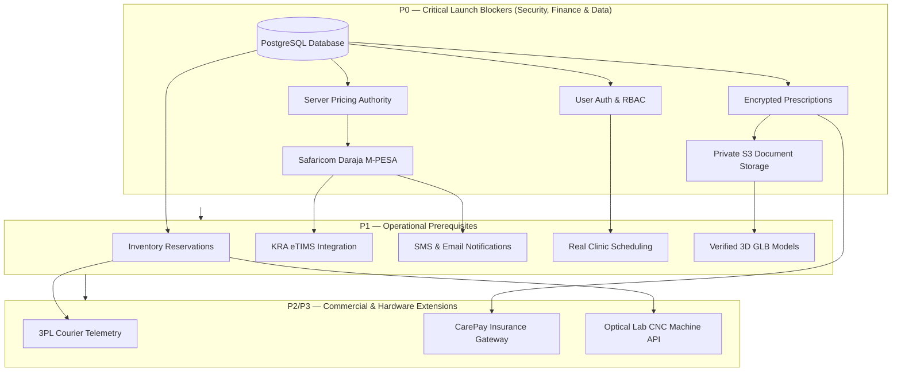

# EYEKART — PRODUCTION GAP MATRIX & RISK RANKING
## Phase 6.0 Comprehensive Readiness Audit & Dependency Mapping
**Authoritative Engineering Audit & Risk Directive**  
**Version:** 1.0  
**Date:** September 15, 2026  
**Status:** COMPLETE & AUTHORITATIVE  
**Classification:** `PASS — PRODUCTION GAP MATRIX COMPLETE`  

---

## 1. EXECUTIVE SUMMARY & GAP TAXONOMY

This master matrix identifies every architectural, security, data, and operational gap between EyeKart's current client-orchestrated demonstration state and a fully hardened, regulatory-compliant optical commerce platform.

### Priority Classifications:
- **P0 — Critical:** Security, financial settlement, clinical data privacy, and data integrity prerequisites. Launch blocker.
- **P1 — Required:** Core business operational capabilities required for public production launch.
- **P2 — Important:** Post-launch commercial integrations, CMS capabilities, and automated EDI rails.
- **P3 — Future Enhancement:** Long-term automation, advanced telemetry, and machine learning enhancements.

---

## 2. MASTER PRODUCTION GAP MATRIX

| Capability | Current Demo State | Required Production State | Architecture Gap | Risk Level | Priority | Key Dependencies |
| :--- | :--- | :--- | :--- | :--- | :--- | :--- |
| **Price Authority** | Client JS calculates frame, lens, VAT, total in store | Server recalculates quote authoritatively from catalog database | Complete: client controls prices | Financial Loss / Fraud | **P0** | PostgreSQL catalog schema |
| **Payment Gateway** | Simulated STK push with mock receipt `SFA91028X4` | Live Safaricom Daraja 2.0 OAuth, STK push, & webhooks | Complete: mock timers only | Fraudulent Orders | **P0** | Safaricom Paybill / Till Credentials |
| **Relational Database**| In-memory state persisted to browser `localStorage` | PostgreSQL 16 with ACID transactions & foreign keys | Complete: zero server persistence | Total Data Loss | **P0** | Managed DB cluster (AWS/GCP) |
| **User Authentication**| Dummy user profile in store (`Zawadi Kamau`) | Argon2id password hashing, HTTP-only JWT cookies, MFA | Complete: no authentication exists | Account Takeover | **P0** | Auth service & token store |
| **RBAC Enforcement** | Simulated role strings in store (`CUSTOMER`, `ADMIN`) | Server-enforced middleware verifying signed JWT roles | Complete: client toggles any role | Privilege Escalation | **P0** | User role schema & session store |
| **Prescription Security**| Plaintext JSON stored in browser `localStorage` | Field-level AES-256 encryption, HIPAA/DPA retention | Complete: zero encryption or privacy| Regulatory Fine / Breach | **P0** | KMS keys & cryptographic module |
| **Clinical Document Store**| Mock PDF toast (`Official Signed Clinical Dossier`) | Private S3 bucket with server-side encryption & signed URLs | Complete: no files stored or served| Medical Records Loss | **P0** | AWS S3 / GCP Storage bucket |
| **Inventory Management**| Hardcoded `stock: 14` property in catalog | ACID stock reservation, allocation, & reorder alerts | Complete: static property only | Overselling / Stockout | **P1** | Database transaction engine |
| **Tax Invoicing (KRA)**| Hardcoded string `KRA-ETR-2025-0098412` | Live KRA TIMS / eTIMS middleware API integration | Complete: fake serial generation | Tax Non-Compliance | **P1** | KRA eTIMS API Key & Trader PIN |
| **3D GLB Frame Assets** | WebGL canvas ready; assets missing (`check 404`) | Production-verified, Draco-compressed GLB frame models | Missing: 3D CAD/GLB assets | Feature Degraded | **P1** | Industrial 3D frame CAD assets |
| **Appointment Booking**| Simulated slot selection saved to `localStorage` | Live practitioner scheduling with double-booking locks | Complete: mock calendar only | Missed Appointments | **P1** | Clinic calendar integration |
| **Courier Telemetry** | Simulated rider telemetry (`Juma Kamau`, electric moto)| Real-time 3PL courier API integration (Sendy/Fargo) | Complete: fake interval updates | Logistics Failure | **P1** | 3PL Dispatch Partner API |
| **Customer Notifications**| In-browser UI toasts only | Automated SMS (Africa's Talking) & transactional email | Complete: no outbound messaging | Poor Customer Experience| **P1** | SMS / Email gateway credentials |
| **Audit Logging** | Local `lifecycleHistory` array in order object | Immutable, append-only PostgreSQL `audit_logs` table | Complete: mutable client data | Audit / Compliance Failure| **P1** | Database audit table & workers |
| **Content Management** | Hardcoded text and links across 23 Stitch panels | Headless CMS (Strapi/Contentful) for banners & blogs | Missing: all text in HTML files | Inflexible Marketing | **P2** | Headless CMS setup |
| **Insurance EDI Rails**| Simulated pre-auth vouchers (`JUB-OPT-2025-8841X`)| CarePay / Smart Applications live insurance claims EDI| Complete: mock UI vouchers | Manual Claims Overhead | **P2** | CarePay EDI Partner Gateway |
| **Lab CNC Telemetry** | Simulated lab stages (Surfacing, Coating, QA) | Barcode scanner integration with optical edging CNC | Complete: simulated timers | Lab Production Disconnect| **P3** | Physical optical lab equipment |
| **Wavefront AI Analysis**| Simulated 28-point diopter analysis cards | Automated corneal topography & wavefront aberration ML | Complete: static UI graphics | Marketing-only feature | **P3** | Ophthalmic diagnostic hardware |

---

## 3. RISK ASSESSMENT & CRITICAL PATH

### 3.1 Highest Risk Vulnerabilities (Immediate Focus)
1. **Financial Arbitrage (Price Manipulation):** An attacker can submit an order for KSh 1.00 using browser console scripts. **Mitigation:** Implement strict server-side price computation before accepting checkout intents.
2. **Payment Fraud (Simulated Settlement):** The application currently marks orders as paid without validating with Safaricom. **Mitigation:** Mandate server-side Daraja STK push and authenticated webhook callback handlers.
3. **Medical Confidentiality Breach:** Storing unencrypted refractive data in `localStorage` violates Kenya Data Protection Act 2019 principles. **Mitigation:** Encrypt clinical fields at rest and restrict access via RBAC.

---

## 4. CONCLUSION

The Production Gap Matrix proves that while EyeKart's client architecture is complete and functional as an optical commerce demonstration, production deployment requires closing seven (7) P0 blockers and seven (7) P1 prerequisites. The accompanying Migration Plan provides the exact step-by-step roadmap to close these gaps safely.
