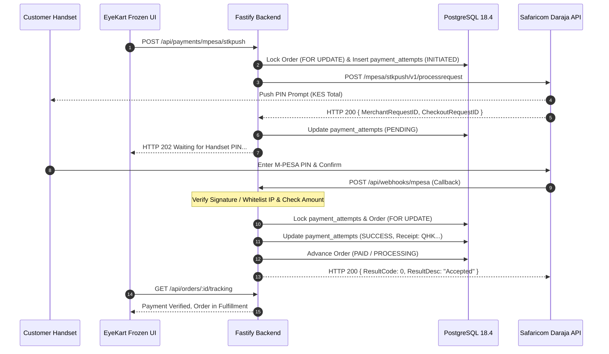

# EYEKART — PHASE 6.5: PRODUCTION EXTERNAL INTEGRATIONS & PAYMENT READINESS
## Comprehensive Architectural Discovery Report (Version 1.0)

---

## Executive Authority & Assessment Classification

```
========================================================================================
FINAL CLASSIFICATION:
PASS — EXTERNAL INTEGRATION DISCOVERY COMPLETE
========================================================================================
```

Following the successful implementation and verification of:
- **Phase 6.1**: Production Backend Foundation (35/35 Assertions Passed)
- **Phase 6.2**: Production Commerce Backend (42/42 Assertions Passed)
- **Phase 6.3**: Production Optical / Clinical Backend (42/42 Assertions Passed)
- **Phase 6.4**: Production Fulfillment, Appointments & Operations Backend (50/50 Assertions Passed)

This Phase 6.5 Discovery Directive conducts a **discovery-first audit** of EyeKart's readiness to integrate live external third-party services.

### Core Discovery Invariants Observed
1. **Zero Live External Calls**: No external HTTP calls were made to payment rails, telecommunications gateways, cloud storage providers, or government fiscal portals.
2. **Zero Fabricated Credentials**: No Paybill numbers, Till numbers, Daraja Consumer Keys, KRA PINs, or SMS sender IDs were invented.
3. **100% Stitch Design Freeze**: All 23 Stitch panels remain completely immutable (0% visual drift, 0 SHA256 hash modifications).
4. **No Premature Deployment**: No DNS changes, domain registrations, or cloud deployments were initiated.

---

## 1. Executive Discovery Answers (The 15 Core Questions)

### Q1: What external integrations already have abstractions?
- **Payment Rails**: `PaymentProvider` abstract base class (`server/src/services/payment/PaymentProvider.js`), defining `initiatePayment()` and `verifyPayment()` with strict lifecycle state machines (`NOT_STARTED`, `INITIATED`, `PENDING`, `SUCCESS`, `FAILED`, `CANCELLED`, `EXPIRED`).
- **Demo Payment Provider**: `DemoPaymentProvider` (`server/src/services/payment/DemoPaymentProvider.js`), executing deterministic in-memory and database simulation.
- **Daraja Provider Stub**: `MpesaDarajaProvider` (`server/src/services/payment/MpesaDarajaProvider.js`), holding the contract for Safaricom Daraja 2.0 STK push and returning explicit HTTP 501 (`LIVE_PAYMENT_DEFERRED`).

### Q2: Which integrations are fully simulated?
- **Safaricom M-PESA STK Push**: Client UI simulates handset prompts; backend executes via `DemoPaymentProvider`.
- **Courier Logistics & Delivery Tracking**: Simulated under `Westlands Central Lab Express Dispatch (DEMO)` and rider `Electric Moto Transporter #EK-E12`.
- **Transactional Notifications (SMS & Email)**: Handset prompts, email newsletters, and order confirmation dispatches are simulated via browser alerts and static markup.
- **Corporate Insurance & EDI Pre-Authorization**: CarePay, Smart Applications, Jubilee, and AAR claims are simulated via mock modal vouchers (`CP-NBO-992014`, `JUB-OPT-2025-8841X`).
- **KRA / eTIMS Fiscal Invoicing**: Mock ETR invoice numbers (`KRA-CU-2024-9982410-KE`) and simulated iTax portal verification buttons in frozen Stitch template.

### Q3: Which integrations have production-ready interfaces?
- **Payment Abstraction**: The `PaymentProvider` interface is architecturally sound and ready to support asynchronous webhook resolution.
- **Fulfillment State Machine**: The 8-stage state graph (`ELIGIBLE` $\to$ `PROCESSING` $\to$ `PRODUCTION` $\to$ `QUALITY_CHECK` $\to$ `PACKED` $\to$ `DISPATCHED` $\to$ `DELIVERED` $\to$ `COMPLETED`) is fully implemented with atomic database persistence and RBAC role enforcement.
- **Appointment Scheduling Engine**: 100% server-authoritative slot generation in `Africa/Nairobi` (UTC+03:00) with PostgreSQL `FOR UPDATE` row-locking preventing double-booking.

### Q4: Which integrations require new interfaces?
- **Webhook Ingestion Engine**: A dedicated provider-neutral webhook ingress interface (`POST /api/webhooks/:provider`) with raw payload signature validation.
- **Cloud Object Storage Adapter**: Interface for private S3-compatible document storage (AWS S3, Cloudflare R2) with presigned upload/download URLs and malware quarantine.
- **Transactional Messaging Provider**: Interface `NotificationProvider` with implementations for SMS (e.g. Africa's Talking) and Email (e.g. Resend / Postmark).
- **Courier Logistics Provider**: Interface `CourierProvider` for automated dispatch booking, parcel dimension transmission, and external tracking webhooks.
- **eTIMS Fiscalization Service**: Interface `TaxFiscalizationService` for transmitting signed electronic invoices to the KRA OSCU / VSCU gateway.

### Q5: Which integrations require business credentials?
- **Safaricom Daraja 2.0**: Consumer Key, Consumer Secret, Business Shortcode (Paybill/Till), Online Passkey, Initiator Username, Security Credential.
- **Kenya Revenue Authority (KRA)**: Company KRA PIN, Tax Compliance Certificate (TCC), eTIMS Technical System Integrator credentials / Control Unit Serial Number.
- **Object Storage**: S3/R2 Access Key ID, Secret Access Key, Bucket Name, Region, Endpoint.
- **SMS Gateway**: Africa's Talking / Twilio Username, API Key, Registered Alphanumeric Sender ID (`EYEKART`).
- **Email Delivery**: Resend / Postmark / SendGrid API Key, Verified Sending Domain (`atelier@eyekart.ke`).

### Q6: Which integrations require legal/business verification?
- **M-PESA Business Account**: Requires Certificate of Incorporation, CR12, Director National IDs, and Business Bank Account details verified by Safaricom.
- **KRA eTIMS Certification**: Requires device registration and fiscal signing key binding with KRA electronic tax compliance authorities.
- **Optical Regulatory Compliance**: Optometrist Council of Kenya (OCK) registration and Pharmacy and Poisons Board (PPB) licensing for ophthalmic appliances.
- **Data Protection Registration**: Formal registration as a Data Controller / Processor under the Kenya Data Protection Act 2019 (ODPC).

### Q7: Which integrations require external webhook endpoints?
- **Safaricom M-PESA**: `POST /api/webhooks/mpesa` for STK Push callback processing and C2B transaction confirmation.
- **Courier Logistics**: `POST /api/webhooks/courier/:carrier` for automated transit milestone ingestion.
- **External Clinical/Insurance Gateways**: `POST /api/webhooks/insurance/adjudication` for asynchronous claim pre-authorization updates.

### Q8: Which integrations require secure document/object storage?
- **Prescription Attachments**: Customer photo/PDF uploads of optometric prescriptions.
- **Clinical Examination Summaries**: Diagnostic visual field charts and diopter printouts.
- **Proof of Delivery**: Delivery rider signature captures and photo receipts.
- **KRA Fiscal Receipts**: Archived signed eTIMS XML / PDF tax invoices.

### Q9: Which integrations require secrets management?
All third-party integrations require isolated, encrypted secrets storage with zero runtime exposure to frontend scripts or client bundles. Secrets must be managed via server-only environment variables or an enterprise secret manager (e.g., AWS Secrets Manager, Doppler, or HashiCorp Vault).

### Q10: Which integrations can be implemented immediately using sandbox/test credentials?
- **Safaricom Daraja 2.0 Sandbox**: Can be integrated using Safaricom's public Daraja Developer Portal test credentials (`sandbox.safaricom.co.ke`).
- **Local / MinIO S3 Object Storage**: Can be integrated for development and automated testing using local containerized S3 storage.
- **Simulated Notification Loggers**: Can be architected with mock transport adapters that verify message payloads without dispatching real SMS.

### Q11: Which integrations must remain blocked until business inputs are supplied?
- **Live M-PESA STK Push**: Strictly blocked until official Safaricom Paybill/Till number and production Daraja keys are approved.
- **Live KRA eTIMS Fiscalization**: Strictly blocked until official EyeKart Company KRA PIN and OSCU/VSCU signing keys are provisioned.
- **Live Courier Dispatch**: Blocked until commercial contract and API agreement with a Kenyan logistics provider (e.g. Sendy, Fargo, DHL).
- **Live Insurance EDI**: Blocked until underwriter agreements with CarePay / SmartHealth partners.

### Q12: What exact engineering work remains?
1. Authoring the `POST /api/webhooks/mpesa` route with raw body buffering, signature/IP verification, and transactional DB row locking.
2. Expanding the `payment_attempts` schema to index `checkout_request_id`, `merchant_request_id`, and `mpesa_receipt_number`.
3. Authoring the S3-compatible presigned URL upload/download engine in Fastify.
4. Authoring provider-neutral `NotificationService` and `CourierService` abstractions.
5. Implementing production HTTPS reverse proxy configuration (NGINX / Caddy / Cloudflare) with `secure: true` session cookies.

### Q13: What exact business inputs remain?
See Section 4 & `EYEKART_PHASE6_5_BUSINESS_INPUT_MATRIX.md` for the complete tabular register.

### Q14: What exact environment variables/secrets will eventually be required?
See Section 3 for the exhaustive `.env` production template.

### Q15: What security controls must exist before live activation?
- Webhook signature verification and Safaricom IP whitelisting.
- Strict amount and currency parity checking ($Amount_{callback} \equiv Total_{order}$).
- Unique database transaction constraints on M-PESA receipt numbers to guarantee idempotency.
- HTTPS TLS 1.3 encryption with strict HTTP-only, `Secure: true`, `SameSite: Strict` cookie enforcement.
- S3 private buckets with signed, expiring download URLs (TTL $\le$ 900 seconds) preventing unauthorized prescription access (IDOR).

---

## 2. Detailed Architectural Audit by Domain

### 2.1 Commerce & Payment Architecture

#### Current State
- `PaymentProvider` defines abstract lifecycle contract (`initiatePayment`, `verifyPayment`).
- `DemoPaymentProvider` simulates instant success or deterministic failure based on test phone patterns (e.g. `999` suffix).
- Order status is synchronized to `PAYMENT_PENDING` upon initiation, and advances to `PAID` or `PROCESSING` upon `SUCCESS`.
- `MpesaDarajaProvider` exists as a stub returning HTTP 501 (`LIVE_PAYMENT_DEFERRED`).

#### Critical Gaps for Live Daraja Readiness


1. **Missing Webhook Route**: No route currently receives Safaricom's asynchronous callback.
2. **Missing In-Flight State**: Daraja callbacks arrive between 5 and 30 seconds after initiation. The system must support polling or status resolution while preserving user feedback.
3. **Missing Correlation IDs**: `payment_attempts` lacks top-level indexed columns for `checkout_request_id` and `merchant_request_id`.
4. **Amount Verification Gap**: The callback amount must be verified down to the exact cent against `orders.total` to prevent underpayment fraud.

---

### 2.2 Webhook & Callback Architecture

#### Recommended Design: `POST /api/webhooks/mpesa`
```javascript
// Recommended Fastify Route Specification
fastify.post('/api/webhooks/mpesa', {
  config: { rawBody: true } // Preserves unparsed payload for HMAC verification
}, async (req, reply) => {
  // 1. IP Whitelisting / Token Verification
  // 2. Parse Callback payload
  // 3. Atomically match CheckoutRequestID in DB (FOR UPDATE)
  // 4. Validate Amount and Currency
  // 5. Update Payment Attempt & Order State
  // 6. Return standard Safaricom ACK
  return reply.status(200).send({ ResultCode: 0, ResultDesc: 'Accepted' });
});
```

#### Invariant Protections
- **Idempotency**: Safaricom retries callbacks if an ACK is delayed. EyeKart must record the `MpesaReceiptNumber` under a unique constraint. If a duplicate receipt is received, EyeKart returns HTTP 200 without executing duplicate inventory releases or status changes.
- **Replay Protection**: Reject any callback with a timestamp older than 300 seconds.

---

### 2.3 KRA / eTIMS Fiscalization Architecture

#### Current State
- `pricingService.js` accurately computes 16% standard VAT on frames and lenses.
- `orders` stores `subtotal`, `vat`, `delivery_fee`, and `total`.
- The Stitch panel `eyekart_kra_etr_tax_invoice_clinical_ophthalmic_certificate` contains complete visual placeholders for KRA QR codes, CU Serial Numbers, and Tax Invoices.

#### Missing Data Elements for Live eTIMS Integration
| Field | Status in Schema | Required eTIMS Specification |
|---|:---:|---|
| **Trader KRA PIN** | ❌ Missing | 11-character alphanumeric PIN (e.g. `P05...`) |
| **Buyer KRA PIN** | ❌ Missing | Optional for retail $< \text{KES } 10,000$; mandatory for B2B / corporate |
| **Control Unit Serial Number** | ❌ Missing | Hardware OSCU / Virtual VSCU device identifier |
| **CU Invoice Number** | ❌ Missing | Sequential fiscal receipt number generated by KRA unit |
| **Cryptographic Signature Hash** | ❌ Missing | 256-bit SHA authentication string generated by Control Unit |
| **KRA Verification QR Code** | ❌ Missing | Dynamic URL pointing to `itax.kra.go.ke` validation endpoint |
| **Harmonized System (HS) Codes** | ❌ Missing | HS 9003.11/19 (Frames), HS 9001.40/50 (Corrective Lenses) |

**Classification**: `REQUIRES EXTERNAL PROVIDER DETAILS & BUSINESS INPUT`.

---

### 2.4 Prescription & Clinical Document Storage

#### Current State
- Prescriptions are strictly stored as numerical diopter values (`od_sph`, `od_cyl`, `od_axis`, `od_add`, `os_sph`, `os_cyl`, `os_axis`, `os_add`, `pd`) in `prescription_revisions`.
- No binary file storage exists in Node.js or PostgreSQL.
- The Stitch configurator contains tab buttons for photo upload, but no file dropzone or upload handler is currently wired.

#### Production Object Storage Architecture
```mermaid
graph LR
    Browser["Client Browser (Frozen UI)"]
    Backend["Fastify API (Port 3001)"]
    S3[("Encrypted Object Storage<br>(AWS S3 / Cloudflare R2)")]

    Browser->>Backend: 1. POST /api/prescriptions/upload-ticket
    Note over Backend: Authenticate User & Validate MIME (image/png, pdf)
    Backend-->>Browser: 2. Presigned S3 PUT URL (TTL: 300s)
    Browser->>S3: 3. Direct Binary Upload (Zero Server Memory Overhead)
    Browser->>Backend: 4. POST /api/prescriptions/confirm-upload { objectKey }
    Backend->>S3: 5. Verify Object Exists & Enforce AES-256
    Backend-->>Browser: 6. Prescription Attached (Pending Optometrist Review)
```

**Security Invariants**:
- Bucket is strictly **private** (Block Public Access enabled).
- Download access requires `GET /api/prescriptions/:id/document-url`, issuing an ephemeral presigned GET URL (TTL: 15 minutes) only after verifying authenticated ownership (Customer IDOR) or optometrist/admin RBAC.

---

### 2.5 Transactional Notifications (SMS & Email)

#### Required Event Register
| Trigger Event | Channel | Priority | Recipient | Payload Details |
|---|:---:|:---:|---|---|
| **Order Placed (Unpaid)** | SMS / Email | Medium | Customer | Order number, M-PESA Paybill instructions, total KES |
| **M-PESA Payment Verified** | SMS & Email | Critical | Customer | M-PESA receipt, order number, amount, estimated dispatch |
| **Clinical Prescription Approved** | SMS & Email | High | Customer | Approval confirmation, surfacing release notice |
| **Prescription Clarification** | SMS & Email | Critical | Customer | Optometrist clinical notes, direct link to clarify diopters |
| **Appointment Confirmed** | SMS & Email | High | Patient | Clinic location, date/time in EAT, practitioner name |
| **Appointment 24h Reminder** | SMS | Medium | Patient | Reschedule/cancellation link, clinic directions |
| **Order Dispatched** | SMS | High | Customer | Courier tracking number, rider name/phone, delivery ETA |
| **Order Delivered** | Email | Low | Customer | Official KRA tax invoice PDF, 14-day warranty certificate |

---

### 2.6 Courier & Delivery Integration

#### Current State
- `fulfillmentService.js` manages fulfillment lifecycle internally.
- Carrier is designated `Westlands Central Lab Express Dispatch (DEMO)`.
- Rider is designated `Electric Moto Transporter #EK-E12`.
- Customer tracking endpoint `GET /api/orders/:id/tracking` returns structured milestone updates.

#### Production Courier Provider Abstraction
To integrate a real logistics partner (e.g. Sendy, Glovo Courier, Fargo Courier, DHL Express Kenya):
1. Maintain the existing provider-neutral `fulfillmentService` and `fulfillments` table.
2. Introduce `CourierProvider` base class:
   - `createShipment({ orderId, fulfillmentId, recipient, address, parcelDetails })`
   - `cancelShipment({ trackingNumber, reason })`
   - `getShipmentStatus({ trackingNumber })`
3. Expose webhook endpoint: `POST /api/webhooks/courier/:carrier` to ingest real GPS / milestone transitions automatically.

---

### 2.7 External Clinical & Insurance Systems

#### Audit Findings
- References to **CarePay**, **Smart Applications**, **Jubilee Insurance**, **AAR Insurance**, and **Aga Khan Hospital** exist purely as decorative/demonstration labels within static Stitch panels (`eyekart_claim_approved_electronic_pre_auth_letter_modal.html` and `eyekart_corporate_optical_insurance_claim_pre_authorization.html`).
- Zero server-side EDI endpoints exist in the backend.
- **Classification**: `BLOCKED_BY_BUSINESS_INPUT` & `LEGALLY_COMPLIANCE_DEPENDENT`. Real health insurance EDI requires signed commercial underwriter agreements and formal regulatory clearance under the Kenya Insurance Regulatory Authority (IRA) and Kenya Data Protection Act 2019.

---

## 3. Production Environment & Secrets Template

Below is the required production configuration specification. No secret values are printed or fabricated:

```ini
# ============================================================
# EYEKART PRODUCTION ENVIRONMENT CONFIGURATION SPECIFICATION
# ============================================================

# Core Environment
NODE_ENV=production
PORT=3001
HOST=0.0.0.0

# Production Database (PostgreSQL 18.x)
DB_HOST=[REQUIRED: Managed DB Endpoint]
DB_PORT=5432
DB_USER=[REQUIRED: Production DB User]
DB_PASSWORD=[REQUIRED: Production DB Password]
DB_NAME=eyekart_production
DB_SSL=true

# Security & Session Secrets (Min 32 random characters)
SESSION_SECRET=[REQUIRED: 64-char Cryptographic Secret]
COOKIE_SECRET=[REQUIRED: 64-char Cryptographic Secret]
SESSION_TTL_HOURS=24

# Production Domain & CORS
PUBLIC_APP_URL=https://eyekart.ke
API_BASE_URL=https://api.eyekart.ke
CORS_ORIGIN=https://eyekart.ke,https://www.eyekart.ke

# Safaricom Daraja 2.0 (M-PESA Integration)
MPESA_ENVIRONMENT=production # or 'sandbox'
MPESA_CONSUMER_KEY=[REQUIRED: Safaricom Daraja Key]
MPESA_CONSUMER_SECRET=[REQUIRED: Safaricom Daraja Secret]
MPESA_SHORTCODE=[REQUIRED: Business Paybill or Till Number]
MPESA_PASSKEY=[REQUIRED: Online Lipa Na M-PESA Passkey]
MPESA_CALLBACK_URL=https://api.eyekart.ke/api/webhooks/mpesa
MPESA_INITIATOR_NAME=[REQUIRED: B2C / Reversal Initiator]
MPESA_SECURITY_CREDENTIAL=[REQUIRED: Encrypted Initiator Cert]

# Object Storage (Prescriptions & Clinical Documents)
STORAGE_PROVIDER=s3 # 's3' or 'r2'
STORAGE_BUCKET=[REQUIRED: Private S3 Bucket Name]
STORAGE_REGION=af-south-1 # e.g. AWS Cape Town or Cloudflare R2
STORAGE_ACCESS_KEY_ID=[REQUIRED: IAM Access Key]
STORAGE_SECRET_ACCESS_KEY=[REQUIRED: IAM Secret Key]

# Transactional SMS (Africa's Talking / Twilio)
SMS_PROVIDER=africastalking
AT_USERNAME=[REQUIRED: Africa's Talking App Username]
AT_API_KEY=[REQUIRED: Africa's Talking API Key]
AT_SENDER_ID=EYEKART # Registered Alphanumeric Sender

# Transactional Email (Resend / Postmark / SendGrid)
EMAIL_PROVIDER=resend
EMAIL_API_KEY=[REQUIRED: Transactional Mailer Key]
EMAIL_FROM="EyeKart Nairobi Atelier <atelier@eyekart.ke>"

# Kenya Revenue Authority (eTIMS)
ETIMS_INTEGRATION_MODE=deferred # or 'live'
KRA_PIN=[REQUIRED: EyeKart Corporate PIN]
ETIMS_DEVICE_SERIAL=[REQUIRED: OSCU / VSCU Serial]
ETIMS_API_KEY=[REQUIRED: Certified System Integrator Key]
```

---

## 4. Architectural Readiness Classification

```
┌───────────────────────────────────────────────┬────────────────────────────┬─────────────────────────────┐
│ Integration Domain                            │ Readiness Status           │ Primary Blocker             │
├───────────────────────────────────────────────┼────────────────────────────┼─────────────────────────────┤
│ Safaricom Daraja (M-PESA Sandbox)             │ ARCHITECTURALLY READY      │ Sandbox Config              │
│ Safaricom Daraja (M-PESA Live)                │ CREDENTIAL READY           │ Safaricom Commercial KYC    │
│ Payment Webhook Ingress                       │ REQUIRES ENGINEERING       │ Route Implementation        │
│ Secure Document Storage (S3 / R2)             │ ARCHITECTURALLY READY      │ Cloud Storage Provisioning  │
│ KRA / eTIMS Invoicing                         │ REQUIRES ENGINEERING       │ Device Serial & Trader PIN  │
│ Transactional SMS Gateway                     │ ARCHITECTURALLY READY      │ Africa's Talking Sender ID  │
│ Transactional Email Gateway                   │ ARCHITECTURALLY READY      │ Domain DNS / Resend Account │
│ Courier Logistics Integration                 │ REQUIRES ENGINEERING       │ Logistics Partner Contract  │
│ Health Insurance EDI (CarePay / Jubilee)      │ BLOCKED BY BUSINESS INPUT  │ Underwriter Agreements      │
│ HTTPS / Secure Cookie Deployment              │ ARCHITECTURALLY READY      │ Domain & Reverse Proxy SSL  │
└───────────────────────────────────────────────┴────────────────────────────┴─────────────────────────────┘
```
