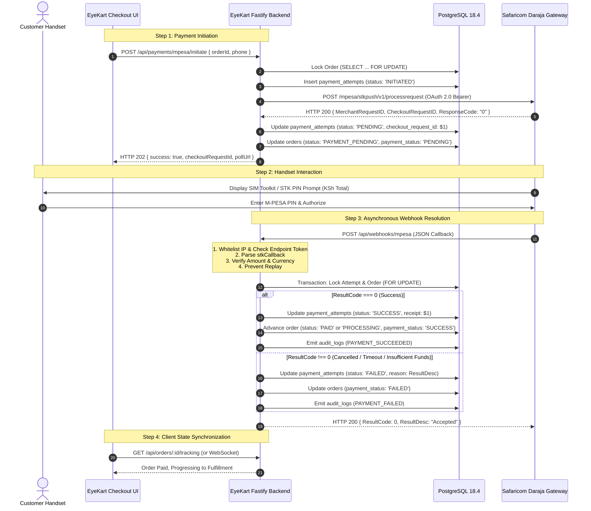

# EYEKART — PHASE 6.5: PAYMENT & WEBHOOK ARCHITECTURE SPECIFICATION
## Safaricom Daraja 2.0 STK Push, Webhook Ingress & Idempotent Reconciliation (Version 1.0)

---

## 1. Executive Summary

This document specifies the technical architecture for transitioning EyeKart from the existing Phase 6.2 `DemoPaymentProvider` to production-ready **Safaricom Daraja 2.0 Lipa Na M-PESA Online (STK Push)** with secure, idempotent webhook callback handling.

### Core Architecture Invariant
In production, the browser client **NEVER** declares whether a payment succeeded.
**Payment authorization is strictly server-authoritative, verified exclusively through Safaricom cryptographic/webhook callbacks or authoritative Daraja STK query polling.**

---

## 2. End-to-End Payment Lifecycle



---

## 3. Database Schema Extensions for Daraja

To support fast indexed lookups during asynchronous callback ingestion, `payment_attempts` must be augmented:

```sql
-- Phase 6.5 Schema Enhancement for Safaricom Daraja
ALTER TABLE payment_attempts 
  ADD COLUMN IF NOT EXISTS checkout_request_id VARCHAR(64),
  ADD COLUMN IF NOT EXISTS merchant_request_id VARCHAR(64),
  ADD COLUMN IF NOT EXISTS mpesa_receipt_number VARCHAR(64),
  ADD COLUMN IF NOT EXISTS phone_number VARCHAR(32);

-- Fast lookup by Safaricom CheckoutRequestID on webhook arrival
CREATE INDEX IF NOT EXISTS idx_payment_attempts_checkout_req 
  ON payment_attempts(checkout_request_id);

-- Enforce strict non-repudiation and idempotency on M-PESA Receipt
CREATE UNIQUE INDEX IF NOT EXISTS uq_mpesa_receipt 
  ON payment_attempts(mpesa_receipt_number) 
  WHERE mpesa_receipt_number IS NOT NULL;
```

---

## 4. Webhook Route Specification: `POST /api/webhooks/mpesa`

### 4.1 Route Security Controls
1. **Network Layer Whitelisting**: The reverse proxy (NGINX / Cloudflare) and Fastify route must strictly validate that requests originate from Safaricom's public IP subnets:
   - `196.201.214.0/24`
   - `196.201.213.0/24`
   - `196.201.215.0/24`
   *(Or verified through Safaricom mTLS / Dedicated Webhook Token)*.
2. **Endpoint Token Ingress**: A random 64-character URL query token (e.g. `/api/webhooks/mpesa?token=SECRET_HOOK_KEY`) configured in the Daraja portal.
3. **Payload Signature**: If Safaricom provides an HMAC header, compute `HMAC-SHA256(rawBody, secret)` before JSON parsing.

### 4.2 Webhook Ingress Payload Example (Safaricom STK Callback)
```json
{
  "Body": {
    "stkCallback": {
      "MerchantRequestID": "29115-34620561-1",
      "CheckoutRequestID": "ws_CO_14092026115934123456789",
      "ResultCode": 0,
      "ResultDesc": "The service request is processed successfully.",
      "CallbackMetadata": {
        "Item": [
          { "Name": "Amount", "Value": 18500.00 },
          { "Name": "MpesaReceiptNumber", "Value": "QHK82910MP" },
          { "Name": "TransactionDate", "Value": 20260914235945 },
          { "Name": "PhoneNumber", "Value": 254712345678 }
        ]
      }
    }
  }
}
```

### 4.3 Atomic Processing Algorithm
```javascript
async function handleMpesaWebhook(payload, clientIp) {
  const { stkCallback } = payload.Body || {};
  if (!stkCallback) {
    throw new BadRequestError('Malformed Safaricom payload');
  }

  const { CheckoutRequestID, ResultCode, ResultDesc, CallbackMetadata } = stkCallback;

  // 1. Begin PostgreSQL Transaction
  const client = await pool.connect();
  try {
    await client.query('BEGIN');

    // 2. Lock the associated payment attempt
    const attemptRes = await client.query(
      `SELECT * FROM payment_attempts WHERE checkout_request_id = $1 FOR UPDATE`,
      [CheckoutRequestID]
    );

    if (attemptRes.rows.length === 0) {
      // Unknown checkout ID; ACK Safaricom to prevent retry storm, but log high-severity alert
      console.error(`[M-PESA Webhook Alert] Unknown CheckoutRequestID: ${CheckoutRequestID}`);
      await client.query('ROLLBACK');
      return { ResultCode: 0, ResultDesc: "Accepted" };
    }

    const attempt = attemptRes.rows[0];

    // 3. Check if already processed (Idempotency Check)
    if (attempt.status === 'SUCCESS' || attempt.status === 'FAILED') {
      console.info(`[M-PESA Webhook Duplicate] Attempt ${attempt.id} already in terminal state ${attempt.status}`);
      await client.query('ROLLBACK');
      return { ResultCode: 0, ResultDesc: "Accepted" };
    }

    // 4. Handle ResultCode
    if (ResultCode === 0) {
      // Extract Callback Metadata
      const metadataItems = CallbackMetadata?.Item || [];
      const receipt = metadataItems.find(it => it.Name === 'MpesaReceiptNumber')?.Value;
      const callbackAmount = Number(metadataItems.find(it => it.Name === 'Amount')?.Value);
      const phone = metadataItems.find(it => it.Name === 'PhoneNumber')?.Value;

      // 5. Lock Order for Reconciliation
      const orderRes = await client.query(
        `SELECT * FROM orders WHERE id = $1 FOR UPDATE`,
        [attempt.order_id]
      );
      const order = orderRes.rows[0];

      // Strict Amount & Currency Verification
      if (Math.abs(Number(order.total) - callbackAmount) > 0.01) {
        console.error(`[M-PESA Fraud Alert] Amount mismatch! Order total: ${order.total}, Received: ${callbackAmount}`);
        await client.query(
          `UPDATE payment_attempts 
           SET status = 'FAILED', failure_reason = 'AMOUNT_MISMATCH_SUSPECTED_TAMPERING', updated_at = NOW() 
           WHERE id = $1`,
          [attempt.id]
        );
        await client.query('COMMIT');
        return { ResultCode: 0, ResultDesc: "Accepted" };
      }

      // Update Attempt to SUCCESS
      await client.query(
        `UPDATE payment_attempts 
         SET status = 'SUCCESS', mpesa_receipt_number = $1, phone_number = $2, updated_at = NOW() 
         WHERE id = $3`,
        [receipt, phone, attempt.id]
      );

      // Advance Order State Machine
      const nextOrderStatus = order.requires_prescription_review ? 'PROCESSING' : 'PAID';
      await client.query(
        `UPDATE orders 
         SET status = $1, payment_status = 'SUCCESS', updated_at = NOW() 
         WHERE id = $2`,
        [nextOrderStatus, order.id]
      );

      // Audit Trail
      await logAuditEvent({
        actorId: order.user_id,
        actorRole: 'SYSTEM',
        action: 'PAYMENT_SUCCEEDED',
        entity: 'Order',
        entityId: order.id,
        metadata: { receipt, callbackAmount, checkoutRequestId: CheckoutRequestID }
      });
    } else {
      // Payment Failed / Cancelled by Customer
      await client.query(
        `UPDATE payment_attempts 
         SET status = 'FAILED', failure_reason = $1, updated_at = NOW() 
         WHERE id = $2`,
        [ResultDesc || `ResultCode_${ResultCode}`, attempt.id]
      );

      await client.query(
        `UPDATE orders SET payment_status = 'FAILED', updated_at = NOW() WHERE id = $1`,
        [attempt.order_id]
      );
    }

    await client.query('COMMIT');
    return { ResultCode: 0, ResultDesc: "Accepted" };
  } catch (err) {
    await client.query('ROLLBACK');
    throw err;
  } finally {
    client.release();
  }
}
```

---

## 5. Polling & STK Push Query Fallback

In cases where Safaricom's callback is dropped or delayed beyond 60 seconds, the EyeKart backend will execute a fallback status inquiry using Daraja's STK Push Query API:

- **Endpoint**: `POST https://api.safaricom.co.ke/mpesa/stkpushquery/v1/query`
- **Payload**:
  ```json
  {
    "BusinessShortCode": "889211",
    "Password": "BASE64_ENCODED(Shortcode + Passkey + Timestamp)",
    "Timestamp": "20260914235945",
    "CheckoutRequestID": "ws_CO_14092026115934123456789"
  }
  ```
- **Resolution**: Updates `payment_attempts` with authoritative status if the customer completed the prompt but the webhook did not reach the server.
