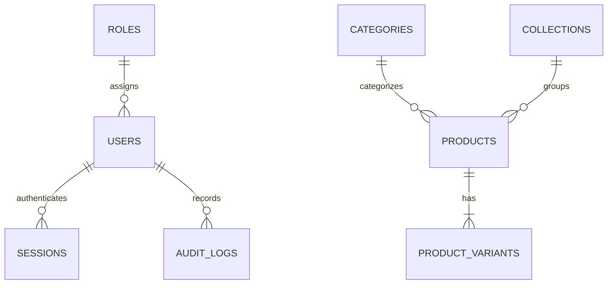

# EYEKART — PHASE 6.1 DATABASE SPECIFICATION
## PostgreSQL Relational Model & Schema Reference
**Authoritative Database Architecture Reference**  
**Version:** 1.0  
**Date:** September 15, 2026  
**Status:** COMPLETE & AUTHORITATIVE  

---

## 1. DATABASE ENVIRONMENT & POOLING

- **RDBMS Engine:** PostgreSQL 18.4 (x86_64-windows)
- **Local Dev Port:** `5433`
- **Databases:**
  - `eyekart_dev`: Active development database.
  - `eyekart_test`: Isolated test database for deterministic automated test execution.
- **Connection Pool:** `pg.Pool` with max 20 connections, 30s idle timeout, and 5s connection timeout.

---

## 2. RELATIONAL ENTITY RELATIONSHIP DIAGRAM

---

## 3. TABLE DEFINITIONS

### 3.1 `roles`
Stores standard system roles.
- `name VARCHAR(32) PRIMARY KEY` (`CUSTOMER`, `STAFF`, `OPTOMETRIST`, `ADMIN`)
- `description TEXT NOT NULL`
- `created_at TIMESTAMPTZ DEFAULT CURRENT_TIMESTAMP`

### 3.2 `users`
Customer, staff, optometrist, and administrator accounts.
- `id UUID PRIMARY KEY DEFAULT gen_random_uuid()`
- `email VARCHAR(255) UNIQUE NOT NULL`
- `phone VARCHAR(32) UNIQUE`
- `password_hash VARCHAR(255) NOT NULL` (scrypt hash format)
- `full_name VARCHAR(128) NOT NULL`
- `role VARCHAR(32) NOT NULL REFERENCES roles(name) DEFAULT 'CUSTOMER'`
- `is_active BOOLEAN NOT NULL DEFAULT TRUE`
- `created_at TIMESTAMPTZ DEFAULT CURRENT_TIMESTAMP`
- `updated_at TIMESTAMPTZ DEFAULT CURRENT_TIMESTAMP`
- *Index:* `idx_users_email` ON `users(email)`

### 3.3 `sessions`
Stateful authentication sessions enabling immediate server-side revocation.
- `id UUID PRIMARY KEY DEFAULT gen_random_uuid()`
- `token_hash VARCHAR(64) UNIQUE NOT NULL` (SHA-256 hash of raw 32-byte token)
- `user_id UUID NOT NULL REFERENCES users(id) ON DELETE CASCADE`
- `expires_at TIMESTAMPTZ NOT NULL`
- `is_revoked BOOLEAN NOT NULL DEFAULT FALSE`
- `ip_address VARCHAR(45)`
- `user_agent TEXT`
- `created_at TIMESTAMPTZ DEFAULT CURRENT_TIMESTAMP`
- *Indexes:* `idx_sessions_token_hash` ON `sessions(token_hash)`, `idx_sessions_user_id` ON `sessions(user_id)`

### 3.4 `categories` & `collections`
Catalog taxonomy tables.
- `categories`: `id VARCHAR(64) PRIMARY KEY`, `name VARCHAR(128) NOT NULL`, `slug VARCHAR(128) UNIQUE NOT NULL`, `description TEXT`
- `collections`: `id VARCHAR(64) PRIMARY KEY`, `name VARCHAR(128) NOT NULL`, `description TEXT`

### 3.5 `products`
Authoritative master catalog.
- `sku VARCHAR(64) PRIMARY KEY` (`EK-902`, `EK-804`, etc.)
- `name VARCHAR(128) NOT NULL`
- `brand VARCHAR(64) NOT NULL DEFAULT 'EyeKart Nairobi Atelier'`
- `category_id VARCHAR(64) REFERENCES categories(id)`
- `collection_id VARCHAR(64) REFERENCES collections(id)`
- `base_price NUMERIC(12, 2) NOT NULL CHECK (base_price >= 0)`
- `compare_at_price NUMERIC(12, 2)`
- `dimensions VARCHAR(32) NOT NULL`
- `weight VARCHAR(16)`
- `bridge INT`, `temple INT`, `lens_width INT`, `lens_height INT`
- `pantoscopic_angle VARCHAR(16)`, `base_curve VARCHAR(16)`, `frame_total_width INT`
- `stock INT NOT NULL DEFAULT 0 CHECK (stock >= 0)`
- `source_conflict VARCHAR(255)` (Preserves EK-902 safeguard)
- `source_conflict_details TEXT`
- `gallery JSONB DEFAULT '[]'::jsonb`
- `prescription_compatibility JSONB DEFAULT '{}'::jsonb`
- `asset_3d JSONB DEFAULT '{}'::jsonb`
- `asset_vto JSONB DEFAULT '{}'::jsonb`

### 3.6 `product_variants`
SKU-level color and finish options.
- `id UUID PRIMARY KEY DEFAULT gen_random_uuid()`
- `sku VARCHAR(64) NOT NULL REFERENCES products(sku) ON DELETE CASCADE`
- `name VARCHAR(64) NOT NULL`
- `color_hex VARCHAR(16) NOT NULL`
- `sku_suffix VARCHAR(16) NOT NULL`
- `price_delta NUMERIC(12, 2) NOT NULL DEFAULT 0.00`
- `is_active BOOLEAN NOT NULL DEFAULT TRUE`
- *Constraint:* `UNIQUE (sku, sku_suffix)`

### 3.7 `audit_logs`
Append-only log of security and administrative operations.
- `id UUID PRIMARY KEY DEFAULT gen_random_uuid()`
- `actor_id UUID REFERENCES users(id) ON DELETE SET NULL`
- `actor_role VARCHAR(32) NOT NULL DEFAULT 'ANONYMOUS'`
- `ip_address VARCHAR(45)`
- `user_agent TEXT`
- `action VARCHAR(64) NOT NULL`
- `entity VARCHAR(64) NOT NULL`
- `entity_id VARCHAR(128)`
- `metadata JSONB NOT NULL DEFAULT '{}'::jsonb`
- `created_at TIMESTAMPTZ NOT NULL DEFAULT CURRENT_TIMESTAMP`
- *Indexes:* `idx_audit_action` ON `audit_logs(action)`, `idx_audit_entity` ON `audit_logs(entity, entity_id)`
