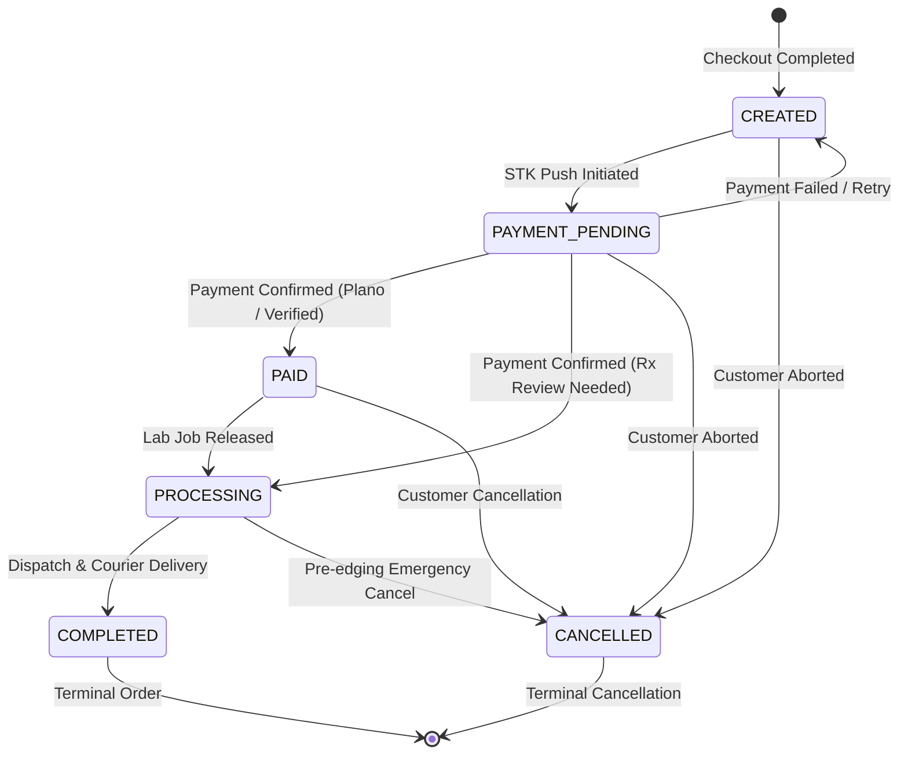

# EyeKart Phase 6.2 — Order State Machine Specification
## Order States, Lifecycle Transitions, and Cancellation Rules (Version 1.0)

---

## 1. Order Lifecycle States

EyeKart orders follow a controlled state machine representing the lifecycle from initial checkout to laboratory fulfillment:

---

## 2. Order States Definition

| State | Description | Cancellation Allowed? |
|---|---|:---:|
| **`CREATED`** | Order generated from authoritative quote; awaiting payment trigger. | Yes |
| **`PAYMENT_PENDING`** | M-PESA STK push is active; awaiting user PIN authorization. | Yes |
| **`PAID`** | Payment verified via provider; awaiting lab surfacing or staging. | Yes |
| **`PROCESSING`** | Optical job queued (or in clinical prescription review). | Yes (pre-edging) |
| **`CANCELLED`** | Order cancelled by customer or administrator. Terminal state. | No (already cancelled) |
| **`COMPLETED`** | Eyewear assembled, quality inspected, and delivered by courier. | No (terminal) |

---

## 3. Cancellation & Refund Rules

1. **Permitted States:**
   - Orders in `CREATED`, `PAYMENT_PENDING`, `PAID`, or `PROCESSING` can be cancelled.
2. **Forbidden States:**
   - Attempting to cancel an order that is already **`COMPLETED`** returns HTTP 400 (`ORDER_CANNOT_BE_CANCELLED`).
   - Attempting to cancel an order that is already **`CANCELLED`** returns HTTP 400 (`ORDER_ALREADY_CANCELLED`).
3. **Simulated Refund Notice:**
   - If an order with `payment_status === 'SUCCESS'` is cancelled, the server sets `refundStatus: 'REFUND_PENDING_DEMO'`.
   - The response and audit logs clearly state:
     `[DEMO PAYMENT] Simulated refund queued. Live financial rail requires production Safaricom integration.`
4. **Audit Trail:**
   - Every cancellation logs an append-only audit event with the actor, reason, timestamp, and metadata.
