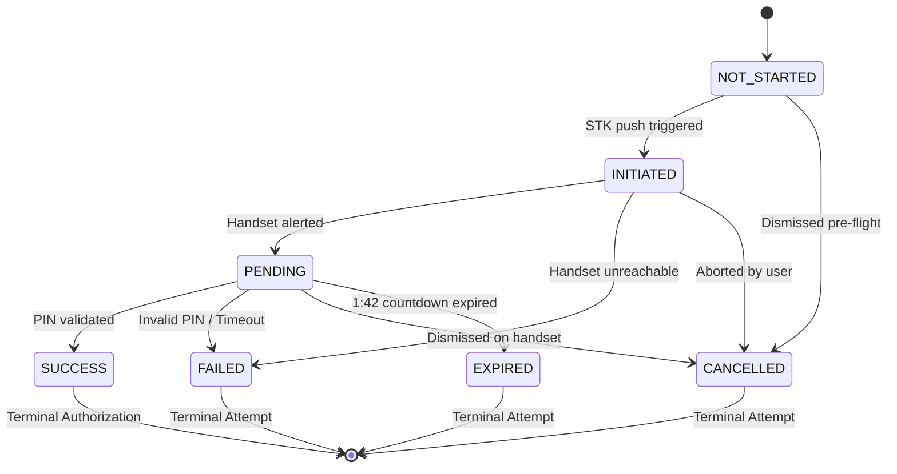

# EyeKart Phase 6.2 — Payment Provider Architecture
## Abstraction, Demo Provider, and State Transitions (Version 1.0)

---

## 1. Provider Abstraction Model

EyeKart's payment architecture decouples commerce order management from specific payment gateways via the `PaymentProvider` interface.

```
                  ┌───────────────────────────────┐
                  │    PaymentProvider (Base)     │
                  │  - initiatePayment()          │
                  │  - verifyPayment()            │
                  └───────────────┬───────────────┘
                                  │
         ┌────────────────────────┴────────────────────────┐
         │                                                 │
         ▼                                                 ▼
┌───────────────────────────────┐         ┌───────────────────────────────┐
│      DemoPaymentProvider      │         │     MpesaDarajaProvider       │
│  - Active in Phase 6.2        │         │  - DEFERRED (Phase 6.2+)      │
│  - Deterministic STK outcomes │         │  - Requires Safaricom creds   │
│  - Zero external dependencies │         │  - Webhook signatures         │
└───────────────────────────────┘         └───────────────────────────────┘
```

---

## 2. Payment State Machine

The payment lifecycle is governed by strict legal transitions. Illegal rollbacks or premature state jumps are explicitly rejected by the engine.



### Legal Transition Matrix:
- **`NOT_STARTED`**: Allowed `INITIATED`, `CANCELLED`.
- **`INITIATED`**: Allowed `PENDING`, `FAILED`, `CANCELLED`.
- **`PENDING`**: Allowed `SUCCESS`, `FAILED`, `CANCELLED`, `EXPIRED`.
- **`SUCCESS`**: Terminal. Any rollback (e.g. `SUCCESS → PENDING`) throws `ILLEGAL_PAYMENT_STATE_TRANSITION` (HTTP 400).
- **`FAILED`**: Terminal for this attempt.
- **`CANCELLED`**: Terminal for this attempt.
- **`EXPIRED`**: Terminal for this attempt.

---

## 3. Demo Payment Realism & Determinism

All Phase 6.2 payment flows are executed under the `DemoPaymentProvider`. To ensure deterministic testing without unpredictable third-party dependencies:
- **Standard Phone Numbers** (e.g., `+254 712 345 678`):
  - Outcome: `SUCCESS`
  - Transaction Reference: Generated `QHK` + 6 digits + `MP`
  - Order Status: Transitions to `PAID` / `PROCESSING`
- **Failure Simulation Phones** (Phone ending with `999` or `0700000000`):
  - Outcome: `FAILED`
  - Failure Reason: `Customer cancelled PIN prompt or handset timeout (Simulated)`
  - Order Status: Retains `PAYMENT_PENDING`, cart items preserved.
- **Idempotency**: Repeated calls with identical `idempotencyKey` return the existing `payment_attempts` record without spawning duplicates.

---

## 4. Payment Reality & Compliance Label

> [!IMPORTANT]
> Every payment artifact generated in Phase 6.2 includes explicit metadata flags:
> `isDemo: true` and `paymentRail: 'Safaricom Daraja 2.0 (Demo Rail)'`.
> No simulated transaction claims real money was transferred.
