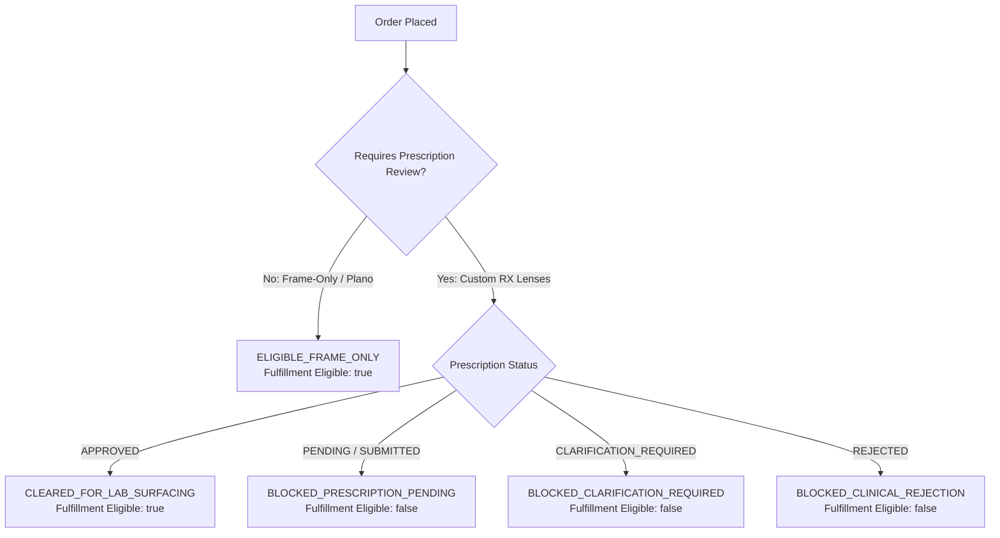

# EyeKart — Phase 6.3: Optical Order Fulfillment Gating Specification
**Version:** 1.0  
**Domain:** Manufacturing & Laboratory Dispatch Authorization  

---

## 1. Architectural Purpose

In bespoke optical commerce, fulfilling an order (blocking glass blanks, digital surfacing, coating, and edging) before an authoritative prescription is verified results in massive scrap rates, delayed deliveries, and clinical safety issues.

Phase 6.3 introduces the **Optical Fulfillment Gate** (`GET /api/orders/:id/fulfillment-eligibility`), which acts as the single source of truth for manufacturing clearance.

---

## 2. Fulfillment Clearance Rules



### 2.1 Scenario A: Frame-Only Order
- Order contains only frames or plano lenses (`requires_prescription_review === false`).
- **Response**:
  ```json
  {
    "orderId": "uuid",
    "orderNumber": "EK-NBI-12345",
    "prescriptionRequired": false,
    "prescriptionStatus": "NOT_APPLICABLE",
    "fulfillmentEligible": true,
    "status": "ELIGIBLE_FRAME_ONLY",
    "clearedAt": "2026-09-15T00:00:00.000Z",
    "notes": "Frame-only order (plano / demo lenses). Bypasses optical prescription gating."
  }
  ```

### 2.2 Scenario B: Prescription Order — Cleared
- Order contains custom prescription lenses (`requires_prescription_review === true`) AND prescription status is `APPROVED`.
- **Response**:
  ```json
  {
    "orderId": "uuid",
    "orderNumber": "EK-NBI-12345",
    "prescriptionRequired": true,
    "prescriptionStatus": "APPROVED",
    "fulfillmentEligible": true,
    "status": "CLEARED_FOR_LAB_SURFACING",
    "notes": "Prescription approved by licensed optometrist. Order authoritatively cleared for laboratory surfacing."
  }
  ```

### 2.3 Scenario C: Prescription Order — Blocked Pending Clearance
- Order contains custom prescription lenses AND prescription status is `PENDING_OPTOMETRIST_REVIEW`.
- **Response**:
  ```json
  {
    "orderId": "uuid",
    "orderNumber": "EK-NBI-12345",
    "prescriptionRequired": true,
    "prescriptionStatus": "PENDING_OPTOMETRIST_REVIEW",
    "fulfillmentEligible": false,
    "status": "BLOCKED_PRESCRIPTION_PENDING",
    "blockingReason": "Prescription review pending optometrist clearance"
  }
  ```

### 2.4 Scenario D: Prescription Order — Blocked on Clarification
- Order contains custom prescription lenses AND prescription status is `CLARIFICATION_REQUIRED`.
- **Response**:
  ```json
  {
    "orderId": "uuid",
    "orderNumber": "EK-NBI-12345",
    "prescriptionRequired": true,
    "prescriptionStatus": "CLARIFICATION_REQUIRED",
    "fulfillmentEligible": false,
    "status": "BLOCKED_CLARIFICATION_REQUIRED",
    "blockingReason": "Clinical clarification requested by optometrist. Customer revision required before fulfillment."
  }
  ```

### 2.5 Scenario E: Prescription Order — Blocked on Rejection
- Order contains custom prescription lenses AND prescription status is `REJECTED`.
- **Response**:
  ```json
  {
    "orderId": "uuid",
    "orderNumber": "EK-NBI-12345",
    "prescriptionRequired": true,
    "prescriptionStatus": "REJECTED",
    "fulfillmentEligible": false,
    "status": "BLOCKED_CLINICAL_REJECTION",
    "blockingReason": "Prescription rejected by optometrist. Review notes required before fulfillment."
  }
  ```

---

## 3. Client Bypass Impossibility

The client cannot bypass fulfillment gating:
- Laboratory edging and dispatch systems query the server-authoritative `/api/orders/:id/fulfillment-eligibility` endpoint before generating lab job tickets.
- Client state in `EyeKartStore` or browser local storage is strictly advisory and cannot force `fulfillmentEligible: true`.
