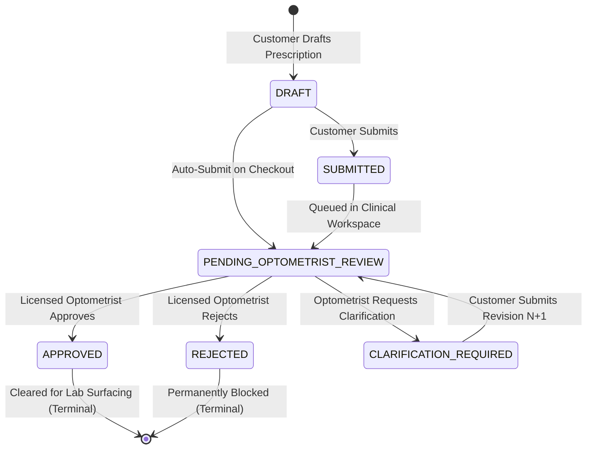

# EyeKart — Phase 6.3: Prescription State Machine & Revision Lifecycle Specification
**Version:** 1.0  
**Domain:** Clinical Optical Commerce  

---

## 1. State Machine Overview

The prescription lifecycle coordinates patient input, optometrist review, clarification cycles, and manufacturing order clearance:

---

## 2. Permitted State Transitions

| Current State | Next State | Trigger / Authorized Actor | Action Taken |
|---|---|---|---|
| `DRAFT` | `SUBMITTED` | Customer (`POST /api/prescriptions/:id/submit`) | Moves prescription into review pipeline |
| `DRAFT` | `PENDING_OPTOMETRIST_REVIEW` | System / Customer (`autoSubmit: true`) | Placed directly into optometrist queue |
| `SUBMITTED` | `PENDING_OPTOMETRIST_REVIEW` | System / Queue Router | Picked up for review |
| `PENDING_OPTOMETRIST_REVIEW` | `APPROVED` | Optometrist / Admin (`POST /api/optometrist/prescriptions/:id/approve`) | Creates approval review record; unlocks order fulfillment |
| `PENDING_OPTOMETRIST_REVIEW` | `REJECTED` | Optometrist / Admin (`POST /api/optometrist/prescriptions/:id/reject`) | Creates rejection review record with reason; blocks order fulfillment |
| `PENDING_OPTOMETRIST_REVIEW` | `CLARIFICATION_REQUIRED` | Optometrist / Admin (`POST /api/optometrist/prescriptions/:id/clarification`) | Creates clarification review record; prompts customer |
| `CLARIFICATION_REQUIRED` | `PENDING_OPTOMETRIST_REVIEW` | Customer (`POST /api/prescriptions/:id/clarification`) | Inserts Revision N+1; returns to optometrist queue |
| `APPROVED` | None | Terminal State | **Mutations Forbidden** |
| `REJECTED` | None | Terminal State | **Mutations Forbidden** |

---

## 3. Illegal Transitions & Security Enforcement

Attempts to execute the following transitions are rejected with HTTP 400 (`ILLEGAL_PRESCRIPTION_STATE_TRANSITION`) or HTTP 403 (`FORBIDDEN`):
1. Any direct client PATCH / PUT to assign `status = 'APPROVED'` or `status = 'REJECTED'`.
2. Transitioning directly from `DRAFT` to `APPROVED` without Optometrist review.
3. Resubmitting clarification when state is NOT `CLARIFICATION_REQUIRED`.
4. Approving or rejecting an already `APPROVED` or `REJECTED` prescription.

---

## 4. Immutable Revision Model

When an optometrist requests clarification:
1. Revision 1 remains **frozen** in `prescription_revisions` (its optical values cannot be modified or deleted).
2. When the customer submits updated parameters, a new row is inserted into `prescription_revisions` with `revision_number = current_revision + 1`.
3. The master prescription record increments `current_revision` and sets `status = 'PENDING_OPTOMETRIST_REVIEW'`.
4. All previous revisions and review notes remain accessible for clinical auditing.
