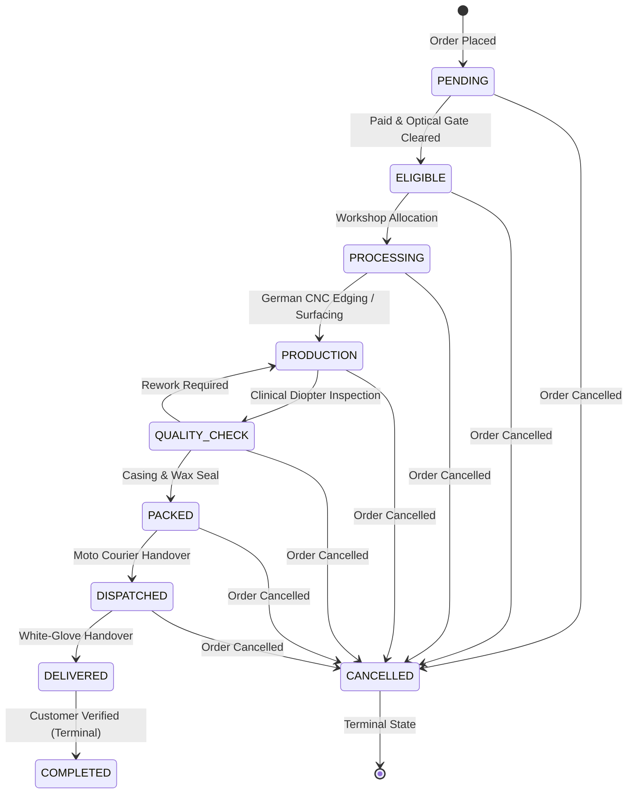
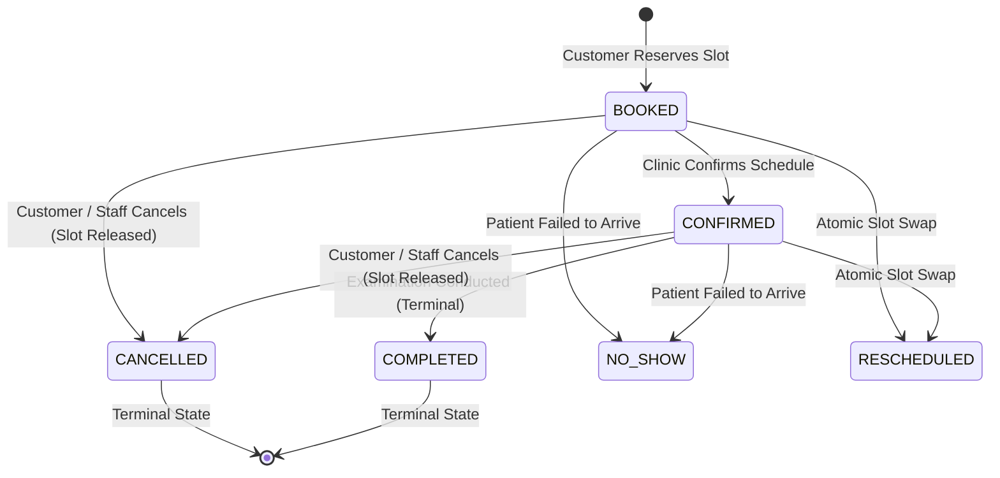

# EyeKart — Phase 6.4: Operational State Machines Specification
**Version:** 1.0  
**Domain:** Fulfillment & Appointment Lifecycle State Machines  

---

## 1. Fulfillment State Machine

The fulfillment lifecycle tracks optical laboratory edging, assembly, quality checks, and dispatch:

### 1.1 Role Gating on State Transitions

| Target State | Permitted Roles | Notes |
|---|---|---|
| `ELIGIBLE` | `STORE_STAFF`, `ADMIN` | Cleared from payment/optical gate |
| `PROCESSING` | `LAB_TECH`, `ADMIN` | Lab workshop job queued |
| `PRODUCTION` | `LAB_TECH`, `ADMIN` | Active optical surfacing / coating |
| `QUALITY_CHECK` | `LAB_TECH`, `OPTOMETRIST`, `ADMIN` | Verifies prescription diopter tolerances |
| `PACKED` | `STORE_STAFF`, `LAB_TECH`, `ADMIN` | Cased in luxury packaging |
| `DISPATCHED` | `STORE_STAFF`, `ADMIN` | Handed to delivery courier |
| `DELIVERED` | `STORE_STAFF`, `ADMIN` | Handover confirmation |
| `COMPLETED` | `STORE_STAFF`, `ADMIN` | Terminal closure |
| `CANCELLED` | `ADMIN` | Administrative cancellation |

Attempts by `CUSTOMER` to transition fulfillment or by unauthorized roles (e.g. `STORE_STAFF` trying `PRODUCTION`) are rejected with HTTP 403 (`UNAUTHORIZED_ROLE_FOR_TRANSITION` / `FORBIDDEN_OPERATIONAL_ACTION`).

---

## 2. Appointment State Machine

### 2.1 Transition Safeguards
- Re-cancelling a `CANCELLED` appointment is rejected.
- Moving from `COMPLETED` or `CANCELLED` to `BOOKED` is rejected with HTTP 400 (`ILLEGAL_APPOINTMENT_TRANSITION`).
- Rescheduling an already `CANCELLED` or `COMPLETED` appointment is rejected.
