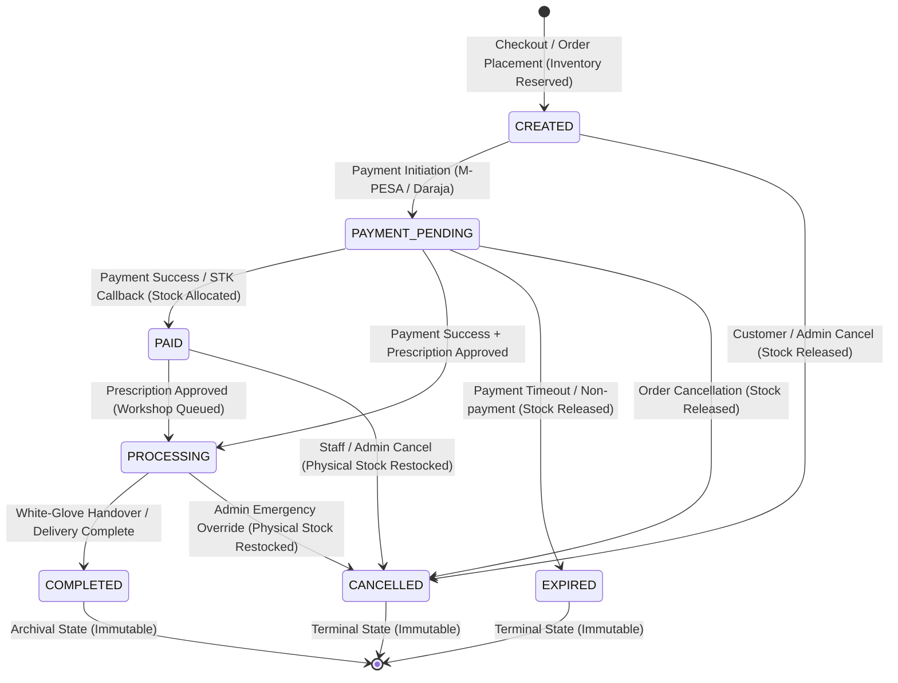
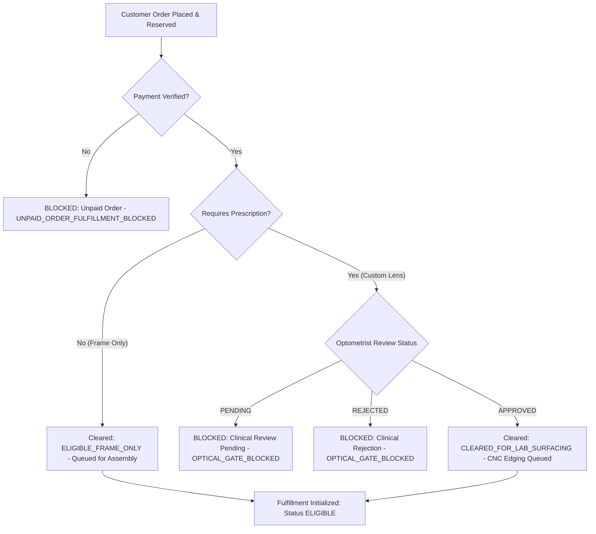

# EyeKart Optical Commerce — Orders, Checkout & Fulfillment Hardening

**Document Version:** 1.0.0  
**Phase:** Phase 5 — Production Orders, Checkout & Fulfillment Hardening  
**Project:** EyeKart Healthcare Limited (Nairobi Atelier & Central Laboratory)  
**Security & Architecture Classification:** Production Hardened  

---

## 1. Executive Architecture Summary

Phase 5 hardens the commercial core of EyeKart. In optical e-commerce, an order is not merely a retail transaction; it is a clinical and manufacturing prescription contract. EyeKart's backend guarantees that:
1. **Server-Authoritative Pricing & Checkout:** Clients submit intent (SKU, quantity, delivery option); the server exclusively computes canonical VAT-inclusive totals from the PostgreSQL database catalog (`products.base_price`). Client-submitted amounts, subtotals, or taxes are strictly ignored.
2. **Atomic Order Creation & Stock Reservation:** Order generation, immutable historical product snapshot capture, and stock reservation execute inside a single PostgreSQL database transaction. Insufficient inventory rolls back the entire transaction without leaving orphan records.
3. **Formal Order State Machine:** Transitions follow a strict directed acyclic graph (`CREATED` $\rightarrow$ `PAYMENT_PENDING` $\rightarrow$ `PAID` $\rightarrow$ `PROCESSING` $\rightarrow$ `COMPLETED`). Terminal states (`COMPLETED`, `CANCELLED`, `EXPIRED`) are strictly immutable. Backward mutations (e.g. `PAYMENT_PENDING` $\rightarrow$ `CREATED`) are blocked.
4. **Dual Fulfillment Gating (Payment & Optical Prescription):** An order cannot enter laboratory surfacing or express courier dispatch unless two independent gates clear:
   - **Payment Gate:** Authoritative receipt of payment (`SUCCESS` / `PAID`).
   - **Clinical Gate:** For custom prescription lenses, explicit review and sign-off by a licensed optometrist (`prescription_status = 'APPROVED'`). Frame-only orders bypass clinical review once paid.
5. **Strict IDOR Hardening:** Customer order endpoints (`GET /api/orders`, `GET /api/orders/:id`, `POST /api/orders/:id/cancel`, `GET /api/orders/:id/tracking`, `GET /api/orders/:id/fulfillment-eligibility`) enforce customer ownership scoping. Direct operational status mutation (`PATCH /api/orders/:id/status`) is strictly restricted to administrative and operational roles (`ADMIN`, `STORE_STAFF`, `OPTOMETRIST`).
6. **Administrative Telemetry:** Dedicated endpoint `GET /api/admin/orders` provides paginated administrative order monitoring with status filtering and search.

---

## 2. Order State Machine

### Legal Transitions Matrix

| Current State | Permitted Next States | Authorized Roles | Inventory Mutation |
|:---|:---|:---|:---|
| `CREATED` | `PAYMENT_PENDING`, `CANCELLED` | Customer, Admin | `RESERVED` on create; `RELEASED` on cancel |
| `PAYMENT_PENDING` | `PAID`, `PROCESSING`, `CANCELLED`, `EXPIRED` | System (Webhook/Callback), Customer, Admin | `ALLOCATED` on payment; `RELEASED` on expiry/cancel |
| `PAID` | `PROCESSING`, `CANCELLED` | Optometrist, Store Staff, Admin | Physical `stock` restored if cancelled |
| `PROCESSING` | `COMPLETED`, `CANCELLED` | Lab Tech, Store Staff, Admin | Physical `stock` restored if cancelled |
| `COMPLETED` | *(None — Terminal)* | None | Immutable |
| `CANCELLED` | *(None — Terminal)* | None | Immutable |
| `EXPIRED` | *(None — Terminal)* | None | Immutable |

> [!CAUTION]
> Backward state transitions (e.g. `PAYMENT_PENDING` $\rightarrow$ `CREATED`, `COMPLETED` $\rightarrow$ `PROCESSING`) are strictly rejected with `400 ILLEGAL_ORDER_STATE_TRANSITION`. Terminal states can never be altered.

---

## 3. Inventory Reservation & Allocation Strategy

EyeKart implements a zero-overselling, race-free two-phase inventory lifecycle utilizing PostgreSQL `FOR UPDATE` row-locking:

1. **Reservation Phase (`orderService.createOrderFromQuote`):**
   - Executed within the order creation transaction.
   - Evaluates `products.stock - products.reserved_stock >= requested_qty`.
   - Increments `products.reserved_stock` by requested quantity.
   - Inserts record into `inventory_reservations` with status `RESERVED`.
   - If stock is insufficient, the transaction rolls back cleanly; no order row is persisted.

2. **Allocation Phase (`inventoryService.allocateStock`):**
   - Triggered upon authoritative payment verification (`PAYMENT_SUCCESS`).
   - Locks `inventory_reservations` row with `FOR UPDATE`.
   - Converts status from `RESERVED` to `ALLOCATED`.
   - Atomically decrements `products.stock` by quantity.
   - Atomically decrements `products.reserved_stock` by quantity.
   - **Idempotency Guarantee:** If multiple callbacks arrive, subsequent invocations detect `ALLOCATED` status and exit cleanly without double-decrementing stock.

3. **Release & Restock Phase (`inventoryService.releaseStock`):**
   - **Pre-Payment Cancellation / Expiry:** Releases `RESERVED` stock back to the available pool by decrementing `products.reserved_stock` and marking the reservation `RELEASED`.
   - **Post-Payment Cancellation:** Restores physical inventory by incrementing `products.stock` and marking the reservation `RELEASED`, preventing inventory leakage when paid orders are cancelled before dispatch.

---

## 4. Optical Fulfillment Gating Architecture

---

## 5. Implementation & Test Status Matrix

| Component / Requirement | Description | Status | Verification Reference |
|:---|:---|:---|:---|
| **Order State Machine** | Canonical legal state transitions and illegal mutation prevention | `IMPLEMENTED` & `TESTED` | Assertions 1 & 2 (`scratch/verify_phase5_order_fulfillment.js`) |
| **Ownership Scoping** | Customer order queries scoped strictly to authenticated user | `IMPLEMENTED` & `TESTED` | Assertion 3 (`scratch/verify_phase5_order_fulfillment.js`) |
| **IDOR Protection** | Cross-tenant access blocked on view, cancel, status, tracking, and gating | `IMPLEMENTED` & `TESTED` | Assertion 4 (`scratch/verify_phase5_order_fulfillment.js`) |
| **Server-Authoritative Pricing** | Quote engine recalculates subtotal, VAT (16%), and delivery from canonical catalog | `IMPLEMENTED` & `TESTED` | Assertion 5 (`scratch/verify_phase5_order_fulfillment.js`) |
| **Quantity Validation** | Quantities $\le 0$, $> 100$, and non-integers rejected with 400 | `IMPLEMENTED` & `TESTED` | Assertion 6 (`scratch/verify_phase5_order_fulfillment.js`) |
| **SKU Validation** | Unknown SKUs rejected with 400 `INVALID_CHECKOUT_ITEMS` | `IMPLEMENTED` & `TESTED` | Assertion 7 (`scratch/verify_phase5_order_fulfillment.js`) |
| **Stock Reservation** | Atomic reservation on order creation | `IMPLEMENTED` & `TESTED` | Assertion 8 (`scratch/verify_phase5_order_fulfillment.js`) |
| **Atomic Order Rollback** | Transaction rollback on stock failure prevents orphan orders | `IMPLEMENTED` & `TESTED` | Assertion 9 (`scratch/verify_phase5_order_fulfillment.js`) |
| **Stock Allocation** | Idempotent transition from `RESERVED` to `ALLOCATED` on payment | `IMPLEMENTED` & `TESTED` | Assertion 10 (`scratch/verify_phase5_order_fulfillment.js`) |
| **Payment Failure Safety** | Failed payments preserve reservation and allow customer retry | `IMPLEMENTED` & `TESTED` | Assertion 11 (`scratch/verify_phase5_order_fulfillment.js`) |
| **Payment Expiration Safety** | Expired payments release reserved inventory | `IMPLEMENTED` & `TESTED` | Assertion 12 (`scratch/verify_phase5_order_fulfillment.js`) |
| **Cancellation Safety** | Releases reserved stock or restocks physical stock if already allocated | `IMPLEMENTED` & `TESTED` | Assertion 13 (`scratch/verify_phase5_order_fulfillment.js`) |
| **Payment Retry Safety** | Re-attempts on existing order reuse active reservation without duplication | `IMPLEMENTED` & `TESTED` | Assertion 14 (`scratch/verify_phase5_order_fulfillment.js`) |
| **Duplicate Callback Safety** | Idempotent webhook handling prevents double stock decrement | `IMPLEMENTED` & `TESTED` | Assertion 15 (`scratch/verify_phase5_order_fulfillment.js`) |
| **Clinical Prescription Gate** | Custom optical lens orders blocked until licensed optometrist approval | `IMPLEMENTED` & `TESTED` | Assertion 16 (`scratch/verify_phase5_order_fulfillment.js`) |
| **Payment Prerequisite Gate** | Unpaid orders strictly blocked from entering fulfillment | `IMPLEMENTED` & `TESTED` | Assertion 17 (`scratch/verify_phase5_order_fulfillment.js`) |
| **Historical Snapshot Immutability** | `order_items` snapshots unaffected by subsequent catalog price changes | `IMPLEMENTED` & `TESTED` | Assertion 18 (`scratch/verify_phase5_order_fulfillment.js`) |
| **Concurrent Inventory Safety** | Row-locking (`FOR UPDATE`) prevents overselling under race conditions | `IMPLEMENTED` & `TESTED` | Assertion 19 (`scratch/verify_phase5_order_fulfillment.js`) |
| **Admin Order API** | `GET /api/admin/orders` with pagination, filtering, and role enforcement | `IMPLEMENTED` & `TESTED` | Assertion 20a (`scratch/verify_phase5_order_fulfillment.js`) |
| **3D / VTO & Stitch UI Regression** | WebGL 3D Canvas, ThreeStudio, VTO, and Stitch panels 100% operational | `IMPLEMENTED` & `TESTED` | Assertion 20 & CDP Suite (`scratch/verify_premium_3d_experience.js`) |
| **Live Safaricom Daraja M-PESA** | Live Daraja API credentials and Safaricom production whitelist | `BLOCKED` | Awaiting corporate Safaricom Daraja business activation |
| **Live Courier Logistics API** | Sendy / Fargo / G4S API integration for real-time automated dispatch | `BLOCKED` | Awaiting corporate courier vendor SLA contracts |
| **Physical Barcode / RFID Scanning** | Physical warehouse handheld barcode scanner integration | `BLOCKED` | Physical hardware integration reserved for post-launch operations |
| **KRA eTIMS Tax Transmission** | Electronic Tax Invoice Management System fiscal transmission | `BLOCKED` | Reserved for dedicated tax integration phase |

---

## 6. Real-World Readiness & Operational Guardrails

- **Zero Client Trust:** Pricing, inventory, tax, and delivery charges are calculated exclusively on the server.
- **Auditable Lifecycle:** Every transition in orders, payments, fulfillments, and prescriptions writes an immutable audit record to `audit_logs` with actor role, IP address, and transition metadata.
- **Fail-Safe Processing Cancellation:** Customers are prevented from self-cancelling orders once optical surfacing has commenced (`PROCESSING`), protecting against unrecoverable lab material loss while providing staff override mechanisms.
