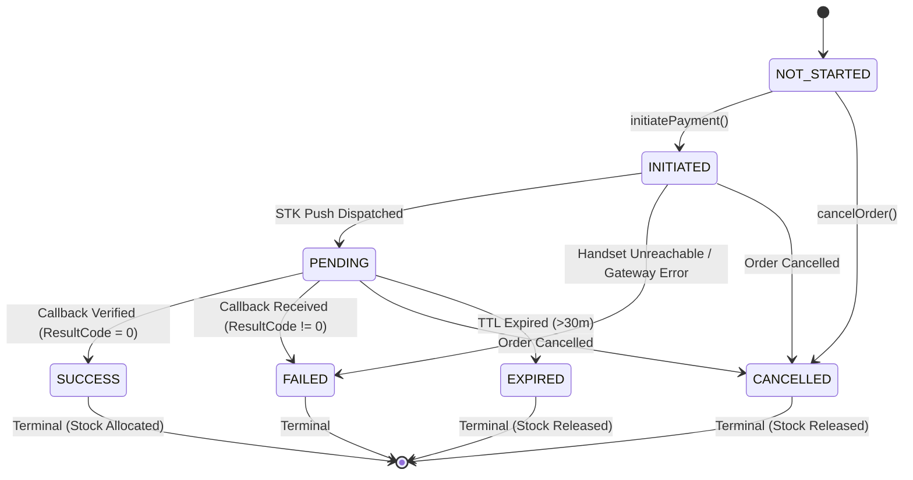
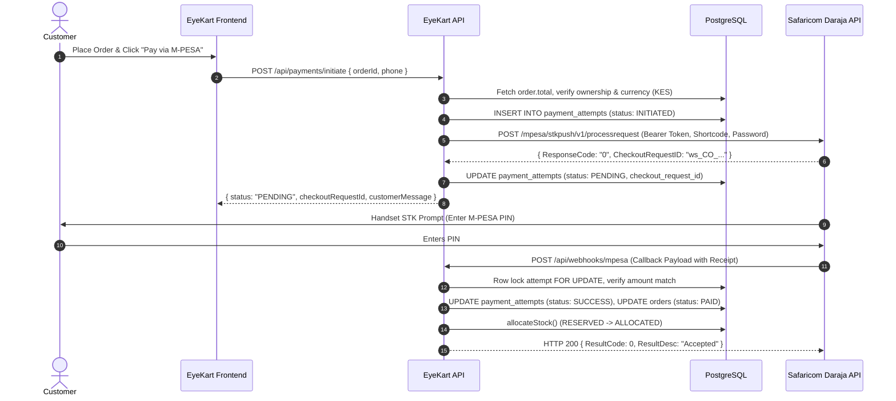

# EyeKart — Production Payment Architecture & M-PESA Foundation

**Document Version**: 1.0.0  
**Project**: Eye KART Healthcare Limited  
**Location**: Nairobi, Kenya  
**Branch**: `main`  
**Current HEAD**: `6dbf61b` (Phase 4 Foundation)  
**Status**: `ARCHITECTURE & INTEGRATION READY`  
**Live Safaricom Status**: `BLOCKED — CREDENTIALS NOT PROVISIONED`

---

## 1. Executive Summary & Objective

EyeKart operates an optical e-commerce and digital health platform in Nairobi, Kenya. As Kenyan retail transactions are overwhelmingly conducted through mobile money, **Safaricom M-PESA** (Lipa Na M-PESA Online / STK Push) serves as the primary payment rail for all frame, lens, and clinical service orders.

This document defines the production payment architecture, security invariants, state machine, idempotency safeguards, and inventory reconciliation mechanisms implemented in **Phase 4**.

> [!IMPORTANT]
> **Live M-PESA Credentials Notice**:
> Live Safaricom Daraja API credentials (`MPESA_CONSUMER_KEY`, `MPESA_CONSUMER_SECRET`, `MPESA_PASSKEY`, and shortcode `174379` or Paybill/Till number) have **not** been provisioned by the project owner.
> In accordance with production security protocol, **no credentials, shortcodes, or live transactions have been fabricated**. The system fails safely (`HTTP 503 PROVIDER_DISABLED`) when Daraja is enabled without credentials, and provides a deterministic `DemoPaymentProvider` strictly for development, testing, and CI verification.

---

## 2. Core Payment Domain Model & State Machine

Every payment transaction in EyeKart is modeled as an immutable, audited record in the `payment_attempts` table, tied to an authoritative database `orders` record.

### 2.1 Allowed Payment States

| State | Type | Description |
| :--- | :--- | :--- |
| `NOT_STARTED` | Initial | Payment has not been initiated for this order. |
| `INITIATED` | Transitional | Server has validated order ownership and created payment attempt record. |
| `PENDING` | Transitional | STK Push dispatched to Safaricom Daraja; awaiting handset PIN entry by customer. |
| `SUCCESS` | Terminal | Authoritative payment confirmation received, verified, and stock allocated. |
| `FAILED` | Terminal | Customer cancelled prompt, handset timed out, or insufficient M-PESA balance. |
| `CANCELLED` | Terminal | Order cancelled by customer/admin before payment completion. |
| `EXPIRED` | Terminal | Payment TTL exceeded (default: 30 minutes) without callback/confirmation. |

### 2.2 Legal State Transition Matrix

Payment state mutations are governed by `isValidPaymentTransition(fromState, toState)` in `PaymentProvider.js`:



**State Mutation Invariants**:
- Terminal states (`SUCCESS`, `FAILED`, `CANCELLED`, `EXPIRED`) **cannot transition** to any other state.
- Skipping states (e.g. `NOT_STARTED` directly to `SUCCESS`) is strictly rejected (`400 ILLEGAL_PAYMENT_STATE_TRANSITION`).
- An initiation response **must never** mark an order as `PAID`. Only verified callbacks or explicit completions transition to `SUCCESS`.

---

## 3. Server-Authoritative Pricing & Anti-Tampering

EyeKart enforces strict server-side price authority to prevent client-side price tampering or underpayment attacks.

1. **Database Source of Truth**: The total payable amount is derived solely from `orders.total` in PostgreSQL.
2. **Client Amount Verification**:
   - If the client omits `amount`, the endpoint defaults to `order.total`.
   - If the client supplies an `amount` parameter, it is strictly validated against `order.total`. Any discrepancy $> 0.01$ KES is immediately rejected with `400 AMOUNT_MISMATCH`.
3. **Webhook Tamper Verification**:
   - When Safaricom returns a payment callback with `CallbackMetadata.Amount`, the webhook ingress engine verifies that the received amount matches `orders.total`.
   - If a tampered callback is received (e.g. an attacker paying 1 KES for a 13,800 KES order), the engine:
     - Sets attempt status to `FAILED`.
     - Logs a critical security alert: `SECURITY_ALERT_PAYMENT_TAMPERING`.
     - Leaves order status in `PAYMENT_PENDING` with `payment_status = 'FAILED'`.
     - Rejects stock allocation.

---

## 4. Kenyan Phone Number Normalization

Safaricom Daraja requires MSISDNs in the international Kenyan format: `254XXXXXXXXX` (12 digits).

The static method `DarajaClient.formatPhoneNumber(phone)` normalizes Kenyan mobile numbers:
- `0712345678` $\rightarrow$ `254712345678`
- `+254 712 345 678` $\rightarrow$ `254712345678`
- `712345678` $\rightarrow$ `254712345678`
- `254712345678` $\rightarrow$ `254712345678`

Malformed strings, non-Kenyan international codes, or invalid lengths throw `400 INVALID_PHONE_NUMBER`.

---

## 5. Idempotency & Replay Protection

### 5.1 Initiation Idempotency
Clients must supply an `Idempotency-Key` header (or request body parameter) when initiating payment:
- The database enforces uniqueness on `payment_attempts(idempotency_key)`.
- If a client retries the exact same request due to network drops, the existing `payment_attempt` is returned without creating duplicate charges or dispatching duplicate STK pushes.

### 5.2 Callback Replay Protection
- `WebhookService` locks the payment attempt row via `SELECT ... FOR UPDATE OF pa`.
- If an attempt is already marked `SUCCESS`, the callback returns `HTTP 200` with `duplicate: true` and commits no state changes.
- `mpesa_receipt_number` is verified across all historical payment attempts. If the receipt number was already used on a different order, the callback is rejected with `status: 'DUPLICATE_RECEIPT'`.

---

## 6. Inventory Reservation & Allocation Lifecycle

To eliminate overselling, negative stock, and double-decrement race conditions, EyeKart coordinates inventory across three stages:

```
[Customer Checkout] 
       │
       ▼
 1. Order Creation  ────────► reserveStock()   ──► status = 'RESERVED' (stock locked)
       │
       ├─────────────────────────┬─────────────────────────┐
       ▼                         ▼                         ▼
 2. Payment Success        3. Payment Failure        4. Order Cancel / TTL Expiry
       │                         │                         │
       ▼                         ▼                         ▼
  allocateStock()           User Retries              releaseStock()
  status = 'ALLOCATED'      Stock remains locked      status = 'RELEASED'
  stock decremented                                   stock restored
```

### 6.1 Atomic Stock Allocation
When payment is confirmed (`SUCCESS`):
- `allocateStock({ orderId })` queries `inventory_reservations WHERE order_id = $1 AND status = 'RESERVED' FOR UPDATE`.
- Decrements `products.stock` by the reserved quantity and updates reservation status to `'ALLOCATED'`.
- Subsequent callbacks find 0 rows matching `status = 'RESERVED'`, guaranteeing that inventory is **never decremented twice**.

### 6.2 Stock Release
If an order is cancelled or expires without payment:
- `releaseStock({ orderId })` restores available stock and sets reservation status to `'RELEASED'`.

---

## 7. Safaricom Daraja STK Push Integration Architecture

EyeKart implements standard Safaricom Daraja 2.0 (Lipa Na M-PESA Online):



---

## 8. Provider Abstraction & Registry

EyeKart provides a unified payment provider registry via `server/src/services/payment/index.js`:

```javascript
const { getPaymentProvider } = require('../services/payment');

// Automatically resolves provider based on MPESA_ENVIRONMENT or explicit request
const provider = getPaymentProvider('MPESA_DARAJA'); // or 'DEMO'
```

### Supported Providers:
1. `MpesaDarajaProvider`: Production Safaricom Daraja client. Connects to `https://sandbox.safaricom.co.ke` or `https://api.safaricom.co.ke`.
2. `DemoPaymentProvider`: Deterministic, simulated payment provider used in development and automated testing.

---

## 9. API Reference

### 9.1 POST `/api/payments/initiate`
Initiates payment for an order.
- **Auth**: Required (`requireAuth`)
- **Headers**: `Idempotency-Key` (recommended)
- **Body**:
  ```json
  {
    "orderId": "uuid-or-order-number",
    "phone": "0712345678",
    "provider": "MPESA_DARAJA"
  }
  ```
- **Response** (`200 OK`):
  ```json
  {
    "success": true,
    "provider": "MPESA_DARAJA",
    "status": "PENDING",
    "checkoutRequestId": "ws_CO_16092026123456",
    "merchantRequestId": "mr_987654",
    "customerMessage": "Please check your phone and enter your M-PESA PIN."
  }
  ```

### 9.2 GET `/api/payments/:attemptId/status`
Queries current payment attempt status.
- **Auth**: Required (`requireAuth`)
- **Security**: IDOR protected (only order owner or ADMIN can view).
- **Response** (`200 OK`):
  ```json
  {
    "success": true,
    "payment": {
      "id": "attempt-uuid",
      "orderId": "order-uuid",
      "amount": 13800.00,
      "currency": "KES",
      "status": "SUCCESS",
      "transactionRef": "QHK123456MP",
      "createdAt": "2026-09-16T18:00:00.000Z"
    }
  }
  ```

### 9.3 POST `/api/payments/demo/confirm`
Simulates customer PIN entry in development/test environments.
- **Auth**: Required
- **Security**: Disabled in production (`process.env.NODE_ENV === 'production'`).
- **Body**:
  ```json
  {
    "attemptId": "attempt-uuid",
    "outcome": "SUCCESS"
  }
  ```

### 9.4 POST `/api/payments/daraja/stkpush`
Direct Daraja STK Push initiation endpoint for legacy or direct integration.
- **Auth**: Required

---

## 10. Activation Checklist for Live M-PESA

When Safaricom credentials are provisioned by Eye KART Healthcare Limited, the following steps activate live payments:

1. [ ] Obtain Safaricom Daraja Production Credentials:
   - Business Shortcode (Paybill or Till Number)
   - Consumer Key
   - Consumer Secret
   - Online Passkey
2. [ ] Configure production environment variables in deployment platform (e.g. Render):
   ```env
   MPESA_ENVIRONMENT=LIVE
   MPESA_CONSUMER_KEY=<production_consumer_key>
   MPESA_CONSUMER_SECRET=<production_consumer_secret>
   MPESA_PASSKEY=<production_passkey>
   MPESA_SHORTCODE=<production_shortcode>
   MPESA_CALLBACK_URL=https://api.eyekart.co.ke/api/webhooks/mpesa
   ```
3. [ ] Register Safaricom Confirmation & Validation URLs on Daraja portal if C2B Paybill rail is enabled.
4. [ ] Run integration test using Safaricom Daraja test numbers before enabling live traffic.
